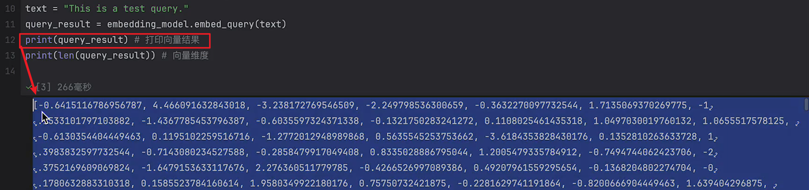

# 0.2025讲的最好的LangChain快速入门视频教程
翻遍整个B站，这绝对是2025讲的最好的LangChain快速入门视频教程，从底层原理到案例实战到面试题，存下吧，比啃书好太多了！少走99%的弯路！
2025-04-17 15:36:52

https://www.bilibili.com/video/BV1Eg5ezyE4A/?spm_id_from=333.337.search-card.all.click&vd_source=4212b105520112daf65694a1e5944e23
  
大模型资料链接: https://pan.baidu.com/s/1DArnJhOdpjZv1KGMZAmBPw?pwd=rjsi    提取码: rjsi 
https://www.yuque.com/aaron-wecc3/dhluml?#     密码：ghkq
================================================================
# 课程介绍 15:03
## 到底如何使用AI大模型？
> 结果不稳定
> 工作流不灵活
> 内容无法定制
> 无法结合已有业务能力

 

================================================================
# 0-环境准备
22:57
## 0.1常用conda命令
### 0.1.1创建Python环境
创建一个Python环境:
```sh
$      conda create -n langchain_env python=3.10
# my cmd
$      conda create -n lchain_quick python=3.10
# To activate this environment, use
#     $ conda activate lchain_quick
# To deactivate an active environment, use
#     $ conda deactivate

conda list #查看当前环境下的依赖
conda install xxx #安装依赖
# 通常会用pip installxxx 安装指令
conda remove xxx #删除依赖
conda update xxx #更新依赖
conda deactivate #退出环境
```

================================================================
# 1_1 LangChain第一战 
25:55

Al大模型的技术发展飞快，但是，关于大模型如何构建本地应用，有些基础的技术是必不可少的。而LangChain就是目前最具影响力的基础技术。 这一章节，我们将快速上手LangChain
框架，熟悉一下用AI大模型构架本地应用的感觉
·langchain第一战 
·访问其他大模型
·流式输出
·提示词模板
·定制参数

LangChain，官网地址：  https://python.langchain.com/docs/introduction/  ,  是一个用于开发由大语言模型LLM提供支持的应用程序的框架，简单来说，就是一个用LLM快速构建本地应用的框架。
构建一个基于LLM的应用需要哪些组件呢？
·首先，需要能够访问各种各样的LLM大模型。LangChain就提供了访问各种大模型的工具，称为Provider。
·然后，需要能够实现各种围绕大模型的功能组件。LangChain就提供了各种Components，分别实现各种功能。
·接下来，还有一些构建复杂应用的非必要的功能扩展。比如对请求记录进行统计，这就是LangChain提供的LangSmith。比如需要对复杂的工作流进行编排，这就是LangChain提供的LangGraph


## 1、langchain第一战
使用LangChain，需要安装LangChain的依赖包
```sh
#安装核心依赖包
!pip install langchain
#安装社区扩展包
!pip install langchain_community
```
langchain目前也在快速迭代中。这里使用的是目前最新的0.3版。


构建LangChain应用之前，如果需要跟踪各种大模型的调用过程，可以在环境变量中指定LangSmith的API_KEY。设置了之后，未来就可以在LangSmith平台查看各种调用大模型的记
录。
LangSmith的APl_KEY需要去LangSmith的官网申请。 地址: https://smith.langchain.com/
    
```py
#设置langsmith的环境变量，用于监控。非必选。
import os
from config.load_key import load_key
os.environ["LANGSMITH_TRACING"] = "true"
os.environ["LANGSMITH_PROJECT"] = "firstLangChainDemo"
os.environ["LANGSMITH_API_KEY"] = load_key("LANGSMITH_API_KEY")
```


接下来，可以使用LangChain提供的chat_model快速访问互联网上的各种Al大模型产品。以OpenAl为例，只需要引l入LangChain针对OpenAl的依赖，就可以快速完成访问。
```py
import os
from config.load_key import load_key

# 制定OpenAI的API_KEY。|
if not os.environ.get("OPENAI_API_KEY"):
    os.environ["OPENAI_API_KEY"]=load_key("OPENAI_API_KEY")

from langchain.chat_models import init_chat_model
#创建访问OpenAI的Model。
# model = init_chat_model("gpt-4o-mini",model_provider="openai")
#openai在国内是无法直接访问的，需要科学上网。这里指定base_urL是因为使用的是openai的国内代理，  2233.ai/chatgpt 。
model = init_chat_model("gpt-4o-mini",model_provider="openai",base_url="https:/ /api.gptsapi.net/v1")
```

API_KEY很重要，通常不要直接在代码中写死，而是放到环境变量中。这里是用一个文件做演示。案例中用的是一个国内能访问的代理。需要自行到网站上申请
API_KEY。 并且，需要提前充值。
接下来，就可以直接使用这个model完成与openai的第一次交互
```py
from langchain_core.messages import HumanMessage,SystemMessage
messages = [
    SystemMessage("Translate the following from English into Chinese"),
    HumanMessage("Hello, how are you?")
]
#返回一个AIMesSage对象。
model.invoke(messages)
# 
# AIMessage(content='你好, 你好吗?', additional_kwargs={'refusal': None}, response_metadata={'token_usage': {'completion_tokens': 5, ?
# s'prompt_tokens': 24, 'total_tokens': 29, 'completion_tokens_details': {'accepted_prediction_tokens': 0, 'audio_tokens': 0, ?
# <'reasoning_tokens': 0, 'rejected_prediction_tokens': 0}, 'prompt_tokens_details': {'audio_tokens': 0, 'cached_tokens': 0}}, 'model_name': 2
# s'gpt-40-mini-2024-07-18', 'system_fingerprint': 'fp_ded0d14823', 'id': 'chatcmpl-BJJfKwv0D3RAUId6m2tV1fRjJfi2f', 'finish_reason': 'stop', ?
# 'logprobs': None}, id='run-c8ff5af7-1d0b-4da0-b456-57683278f2ea-0', usage_metadata={'input_tokens': 24, 'output_tokens': 5, 'total_tokens':2
# , 29, 'input_token_details': {'audio': 0, 'cache_read': O}, 'output_token_details': {'audio': 0, 'reasoning': 0}})

```
从这个案例可以了解到与A大模型交互时，可以有多种不同的消息。
* ·user:用户输入的问题
* ·system:描述问题的背景，或者描述大模型的角色
* ·assistant:模型输出的答案另外还有一种消息类型是function_call，在后面会介绍。了解了这些消息类型后，langchain还支持另外几种openai格式的调用方法。

```py
model.invoke("Hello")
model.invoke([{"role": "user", "content": "Hello"}])
model.invoke( [HumanMessage("Hello")])
```
另外，一次invoke交互可以传多条消息，这个效果就相当于在网页访问大模型时的一个聊天窗口。多次不同的invoke调用就相当于是开了多个不同的聊天窗口。每次invoke调用，大模型
只会理解这一次方法传入的消息作为上下文。


================================================================
# 1_2 快速切换其他大模型
19:14


并且，为了简化代码，langchain对openai的调用方式做了封装，所以，可以直接使用openai的调用方式。使用这个依赖需要安装一个对应的依赖包
```sh
#安装openAI的依赖包
!pip install -qU "langchain[openai]"
```

```py
import os
from config.load_key import load_key
#制定OpenAI的API_KEY。
if not os.environ.get("OPENAI_API_KEY"):
    os.environ["OPENAI_API_KEY"] = Load_kex("OPENAI_API_KEY")

from langchain_core.messages import HumanMessage,SystemMessage    
from langchain_openai import ChatOpenAI
llm = ChatOpenAI(
    madel="gpt-4o-mini",
    base_url="https://api.gptsapi.net/vi/",
)
Llm.invoke([
    SystemMessage("Translate the following from English into Chinese"),
    HumanMessage("HeLlo, how are you?")])
``` 

## 2、访问其他大模型

LangChain要访问其他大模型也非常方便。以国内的DeepSeek为例，langchain直接提供了对于DeepSeek的依赖。
注：deepseek官方文档： https://api-docs.deepseek.com/zh-cn/

* langchain支持的provider列表 ： https://python.langchain.com/docs/integrations/providers/

```sh
#安装deepseek的依赖包
!pip install -U "langchain[deepseek]"
```

```py
# ---- test01/deepseek-chat.py
import os
from config.load_key import load_key
# 制定OpenAI的API_KEY。
if not os.environ.get("DEEPSEEK_API_KEY"):
    os.environ["DEEPSEEK_API_KEY"] = load_key("DEEPSEEK_API_KEY")

from langchain_core.messages import HumanMessage,SystemMessage    
from langchain_deepseek import ChatDeepSeek
# 调用deepseekd的代码，在ChatDeepSeek中就有注释
llm = ChatDeepSeek(
    model="deepseek-chat" , # deepseek的模型名目前包括 deepseek-chat 和 deepseek-reasonser
)
llm.invoke（[HumanMessage（"你是谁？你能帮我解决什么问题？"）]）
# ### output:----
# AIMessage（content='我是**DeepSeekChat**，由深度求索公司开发的智能AI助手。我可以帮助你解答各种问题、提供信息、辅助创作、分析数据，甚至陪你聊天！\n\n###2
# s**我能帮你解决什么问题？** \n1。**知识问答** ：历史、科学、技术、文化等各类问题，我都能提供准确的信息。 \n2。**写作与创意**：帮你写文章、改作文、生成故事、
# s写邮件、做PPT大纲等。 \n3。 **学习辅导**r：数学、编程、语言学习(如英语)、论文写作等，我可以一步步讲解。 \n4。 **代码编写 & 调试** ：Python、Java、C++、2
# SQL等编程问题，我可以写代码、优化代码或解释错误。 \n5。**办公效率**ml：ExceL公式、Word排版、PPT制作、数据分析等，提高你的工作效率。 \n6。 **生活建议** ：2
# 旅行攻略、健康小贴士、美食推荐、心理疏导等。\n7。**文件阅读**：可以上传**PDF、Word、ExceL、PPT、TXT**等文件，我帮你提取信息或总结内容。\n8。**娱乐休2
# 闲**：推荐电影、书籍、游戏，甚至陪你玩文字游戏！\n\n###**我的特点**\nV**免费使用**（目前没有收费计划）\n**支持长文本（128K上下文）**，可以处理2
# 大段内容\nV**可以联网搜索**（需你手动开启），获取最新信息\nV**支持文件上传**，帮你阅读和分析文档\n\n如果你有任何问题，尽管问我吧！你今天想了解什么？2
# s', additional_kwargs={'refusal': None}, response_metadata={'token_usage': {'completion_tokens': 361, 'prompt_tokens': 10, 'total_tokens': 
# <371, 'completion_tokens_details': None, 'prompt_tokens_details': {'audio_tokens': None, 'cached_tokens': O}, 'prompt_cache_hit_tokens': O, ?
# s'prompt_cache_miss_tokens': 103, 'model_name': 'deepseek-chat', 'system_fingerprint': 'fp_3d5141a69a_prod0225', 'id': ?
# .'01d1c13f-9a24-4a17-8b3d-df1424c3607a'. 'finish reason': 'ston'. 'loaprobs': None?. id='run-0888966e-1f7b-48cb-85bd-7fb00977f27d-0'. ,
```

这里的DEEPSEEK_API_KEY需要去DEEPSEEK的官网申请。地址： https://platform.deepseek.com/ 注意需要自行付费。


这些大模型的的访问接口其实都是基于HTTP的方式对接的，所以只要大模型产品能够兼容OpenAl的访问接口，就可以使用OpenAI的API直接访问。例如国内的阿里云百炼大模型
langChain并没有提供直接的集成，但是他是兼容OpenAl的客户端的。所以，也可以使用OpenAl的客户端访问。
注意：同样是要自己去阿里云申请APl_KEY，地址： https://bailian.console.aliyun.com/ 另外，在LangChain的社区扩展langchain-community中，也有人提供了阿里云
百炼的拓展。有兴趣可以自行了解。 
[阿里云百炼提供的deepseek ](https://bailian.console.aliyun.com/?tab=model#/model-market/detail/group-deepseek?modelGroup=group-deepseek)  

```py
# ----  test01/alibailian-deepseek.py
# refer to  https://bailian.console.aliyun.com/?tab=api#/api/?type=model&url=https%3A%2F%2Fhelp.aliyun.com%2Fdocument_detail%2F2868565.html
from langchain_openai import ChatOpenAI
from config.load_key import load_key
from langchain_core.messages.human import HumanMessage

llm = ChatOpenAI(
    model="deepseek-v3",
    base_url="https://dashscope.aliyuncs.com/compatible-mode/v1",
    openai_api_key=load_key("BAILIAN_API_KEY") ,
)
llm.invoke([HumanMessage("你是谁？你能帮我解决什么问题？")])
# ----output:
# AIMessage（content='您好！我是由中国的深度求索（DeepSeek）公司开发的智能助手DeepSe&k-V3。如您有任何任何问题，我会尽我所能为您提供帮助。‘，2
# sadditional_kwargs=f'refusal': None}, response_metadata={'token_usage': 'completion_tokens': 37, 'prompt_tokens': 10, 'total_tokens': 47,
# <'completion_tokens_details': None, 'prompt_tokens_details': None}, 'model_name': 'deepseek-v3', 'system_fingerprint': None, 'id': 2
# s'chatcmpl-72fa405c-d22c-9e7f-b867-ca562834d06b', 'finish_reason': 'stop', 'Logprobs': None}, ?
# sid='run-dlab1cf1-ddd3-4c2e-a055-be5140a89204-0', Usage_metadata={'input_tokens': 10, 'output_tokens': 37, 'total_tokens': 47, ?
# s'input_token_details': {}, 'output_token_details': b})
``` 
当然，也可以换成通义百炼自己的客户端
 
```py
from langchain_community.chat_models import ChatTongyi
from config.load_key import load_key
from langchain_core.messages.human import HumanMessage
llm = ChatTongyi(
    model="qwen-plus",
    api_key=load_key("BAILIAN_API_KEY")
)
llm.invoke([HumanMessage("你是谁？你能帮我解决什么问题？")])
```
 
最后，如果有些大模型产品LangChain确实没有提供具体的实现，也可以在LangChain的设计基础上，自行扩展出新的实现。具体实现方式可以参见官网，当然，让Al帮你生成也是不错
的。


================================================================
# 1_3 大模型的其他交互方式
19:50

## 3、流式输出
LangChain支持流式输出，即输出结果会一个一个Token的蹦出来。
```py
from langchain_openai import ChatOpenAI
llm = ChatOpenAI(  
    madel="qwen-plus", ## madel="deepseek-v3",
    base_url="https://dashscope.aliyuncs.com/compatible-mode/vl",
    openai_api_key=load_key("BAILIAN_API_KEY"),
)

stream =LLm.stream([HumanMessage("你是谁？你能帮我解决什么问题？")])
for chunk in stream:
    print(chunk.text(), end="\n")
```

## 4、提示词模板
LangChain支持使用提示词模板的方式来完成大模型交互。
```py
from langchain_core.prompts import ChatPromptTemplate
prompt_template = ChatPromptTemplate.from_messages([
        ("system","Translate the following from English into {language}"),
        ("user","{text}")
])
prompt = prompt_template.invoke(f"language":"chinese","text":"Hello, how are you?")
printt(prompt)
```

这样就可以更轻松的构建复杂的大模型提示词。
```py
from langchain_openai import ChatOpenAI
llm = ChatOpenAI(
    madel="deepseek-v3",
    base_url="https://dashscope.aliyuncs.com/compatible-mode/vl",
    openai_api_key=Load_key("BAILIAN_API_KEY") ,
)
response = llm.invoke(prompt)
print(response.content)
```

## 5、定制参数
LangChain支持传入更多定制参数，例如temperature，top_p等。而这些能力，通常使用网页或者APP访问大模型时，是无法传入的。以tempreture为例，这是一个[0,2)之间的一个参
数。它的作用是，在模型生成结果时，会根据这个参数的值，来决定模型生成结果的随机性。tempreture越小，大模型生成的结果越固定。tempreture越大，大模型生成的结果越随机。
```py
from langchain_openai import ChatOpenAI
llm = ChatOpenAI(
    madel="qwen-pLus",
    base_url="https://dashscope.alixuncs.com/compatible-mode/v1",
    openai_api_key=load_key("BAILIAN_API_KEY") ,
    temperature=0.1，#[0，2）之间，越大，结果越随机。越小，结果越固定。
)

for i in range(5):
    response=llm.invoke([HumanMessage（"给一款智能手机起一个酷炫的名字？返回字数4个汉字以内"）])
    print(str(i)+">>"+response.content)
```

类似的参数还有top_p也可以影响大模型结果的随机性。top_p越小，大模型生成的结果越固定。top_p越大，大模型生成的结果越随机。不过他影响随机性的方式和temprature不一样。
在阿里的百炼云大模型平台上，还有top_k等更多扩展的参数。多了解这些参数，可以帮助你把大模型用得更加得心应手。

## 6、总结
这一章节，我们还只是初步上手了langchain的一些基础功能。当然，langchain的功能远不止这些。其中不光提供了很多常用的功能，更重要的是，在langchain框架中，积累了很多人对
于AI大模型应该如何落地的思考和经验。未来我们会一步步探索。
================================================================
# 2_1 LCEL链式表达式
22:14
## 二、构建专属聊天机器人

这一章节，我们将使用langChain构建一个专属机器人。这个聊天机器人不光可以进行简单的聊天，还需要提供更多专属的聊天服务。
> ·使用LangChain Expression Language(LCEL)实现多步骤的聊天互动
> ·保存历史聊天记录，实现自动多轮聊天
> ·聊天消息整合LCEL

MCP(Memory Chain Prompt)  -> Agent

## 1、 LangChain Expression Language(LCEL)
一个强大的聊天机器人，当然不能是问一个问题就回一个答案的简单互动，需要能够整合各种大模型，构建复杂的聊天场景。这时，LangChain提供的LCEL表达式就派上了用场。
LangChain Expression Language(LCEL)是LangChain的表达式语言，它提供了一种简单的方式来定义和执行任务。例如，之前与Ai大模型交互的过程，可以用LCEL来表示:

```py
from langchain_core.output_parsers import StrOutputParser
from langchain_core.prompts import ChatPromptTemplate

from config.load_key import load_key
from langchain_openai import ChatOpenAI

# 提示词模板
prompt_template = ChatPromptTemplate.from_messages([
    ("system","Translate the following from English into {language}"),
    ("user","{text}")
    ]) 
# 构建阿里云百炼大模型客户端
llm = ChatOpenAI(
    model="qwen-plus",
    base_url="https://dashscope.aliyuncs.com/compatible-mode/v1",
    openai_api_key=load_key("BAILIAN_API_KEY"),
)

# 结果解析器 StrOutputParser会AIMessage转换成为str，实际上就是获取AIMessage的content属性
parser = StrOutputParser()

# 构建链 
chain = prompt_template | llm | parser

# 直接调用链
print(chain.invoke({"text":"nice to meet you", "language":"chinese"}))
```

通过LangChain的LCEL链式语法，就可以直接构建更为复杂的基于大模型的处理链。例如将某一次大模型调用的结果再次访问另一个大模型，那就只需要再chain的后面再链接更多的组
件即可。

```py
#继续构建更复杂的链
analysis_prompt=ChatPromptTemplate.from_template("我应该怎么回答这句话？{talk}。给我一个五个字以内的示例")
chain2 = {"talk":chain} | analysis_prompt | llm | parser
print(chain2.invoke({"text":"nice to meet you", "language":"Chinese"}))
```

你甚至可以构建多个并行的链，构建更复杂的大模型应用逻辑。下面的案例就会将英文同时翻译成中文和法语，最后将多个翻译结果整合成一个完整的结果
   

```py
from langchain_core.prompts import ChatPromptTemplate
from langchain_core.runnables import RunnableMap, RunnableLambda, RunnableWithMessageHistory

#提示词模板
prompt_template_zh = ChatPromptTemplate.from_messages([
        ("system", "Translate the following from English into Chinese"),
        ("user", "{text}")
        ])

prompt_template_fr = ChatPromptTemplate.from_messages([
        ("system", "Translate the following from English into French"),
        ("user","{text}")
        ])

#构建链
chain_zh = prompt_template_zh | llm | parser
chain_fr = prompt_template_fr | llm | parser

#并行执行两个链
parallel_chains = RunnableMap({
    "zh_translation": chain_zh,
    "fr_translation": chain_fr
    })

# 合并结果
final_chain = parallel_chains | RunnableLambda(lambda x: f"Chinese: {x['zh_translation']}\nFrench: {x['fr_translation']}")

# 调用链
print(final_chain.invoke({"text":"nice to meet you"}))
```

接下来，结合LangGraph，也可以用图形化的方式查看链的运行情况。首先需要安装langgraph库。
```sh
!pip install langgraph
!pip install grandalf
```

接下来就可以打印出图形化的链图。
```py
final_chain.get_graph().print_ascii()
```
  

LangChain的链式语法功能非常强大。甚至可以根据用户输入的问题，动态构建不同的链。另外，在LCEL中，除了可以链接示例中几个简单的组件之外，还可以链接更多组件，完成更
复杂的应用逻辑。后面会逐渐接触到。
实际上，LangChain提供了一个顶级父类，Runnable。只要是Runnable的子类，就都可以链接成一个序列。

================================================================
# 2_2 基于Redis保存历史聊天信息
17:21
## 2、保存聊天记录
接下来，聊天机器人当然要保存聊关记录，这样不光可以让用户和机器人进行多轮对话，还可以根据聊天记录进行检索。在LangChain中，提供了一个BaseChatMessageHistory父类
专门用于保存聊天记录。默认情况下，LangChain只提供了一个基于内存的inMemoryChatMessageHistory来保存聊天记录。

```py
# 
# test01/lcel03memory-chat-history.py
# 
from langchain_core.chat_history import InMemoryChatMessageHistory
# 这是BaseChatMessageHistory的子类
history = InMemoryChatMessageHistory()
#第一轮聊天
history.add_user_message("你是谁?")
aimessage = llm.invoke(history.messages)
print(aimessage.content)
history.add_message(aimessage)
#第二轮聊天如果没有上一次聊天的记录，大模型是不知道要重复什么内容的。
history.add_message("请重复一次")
aimessage2 = llm.invoke(history.messages)
print(aimessage2.content)
history.add_message(aimessage2)
#打印历史聊天记录
# print("Chat History:")
# for message in history.messages:
#   print(f"{type(message).__name__}: {message.content}")
```

当然，这种通过内存管理消息记录的方式是不太安全的，应用一重启，消息记录都丢了。所以，LangChain还提供了很多基于其他存储系统的扩展依赖。比如，可以基于Redis、
MongoDB、PostgreSQL、MySQL等数据库来保存聊天记录。具体参见官网： https://python.langchain.com/docs/integrations/memory/ 以Redis为例，将上面案例中的消息记录保存
到Redis中，要做的，只是替换一下history的实现类。首先需要安装langchain针对redis的扩展依赖。


redis的安装： https://python.langchain.com/docs/integrations/memory/redis_chat_message_history/
```sh
%  pip install -qU langchain-redis langchain-openai redis

%  docker pull redis/redis-stack
# 6379 端口：用于 Redis 数据库的客户端连接（如编程代码或命令行工具）。
# 8001 端口：用于访问 RedisInsight 可视化管理界面。
# 两个端口映射分别服务于不同的使用场景，共同确保 Redis Stack 功能的完整性。
%  docker run -d --name redis-stack -p 6379:6379 -p 8001:8001 redis/redis-stack:latest

# 可以通过连接到 Redis 客户端来测试它：
% docker exec -it redis-stack redis-cli

# 在 Redis CLI 中，你可以运行一些基本的命令来确认 Redis Stack 是否正常工作，例如：
PING
# 如果返回 PONG，那么你的 Redis Stack 容器正在正常运行。

# 步骤 4: 使用 Redis Stack 的模块功能
# Redis Stack 支持多种模块，如 RedisJSON、RedisTimeSeries 等。你可以使用这些模块执行特定的操作。
# 例如，使用 RedisJSON 存储和查询 JSON 数据：
JSON.SET mydoc $.name John
JSON.GET mydoc $.name
# 这些命令展示了如何使用 RedisJSON 模块来设置和获取 JSON 数据。你可以根据自己的需求探索和使用其他模块的功能。
```
然后，替换history的实现。  另外，需要部署Redis服务，过程略过。


```py
# 
#  
# 
from langchain_redis import RedisChatMessageHistory
#这也是BaseChatMessageHistory的子类。本地需启动Redis服务
history = RedisChatMessageHistory(session_id="test",redis_url="redis://locaLhost:6379/0")
#第一轮聊天
history.add_user_message("你是谁? ")
aimessage = llm.invoke(history.messages)
print(aimessage.content)
history.add_message(aimessage)
#第二轮聊天
history.add_user_message("请重复一次")
aimessage2 = llm.invoke(history.messages)
print(aimessage2.content)
history.add_message(aimessage2)
```
 


```sh
% docker exec -it redis-stack redis-cli

127.0.0.1:6379> keys *
 1) "chat:test:01JXY6DV3CVV6EQB5FAGJY3G2F"
 2) "runoobkey"
 3) "greeting"
 4) "chat:test:01JXY0F23ANZTF51PD4HZGHBYG"
 5) "runlist"
 6) "chat:test:01JXY0F9KD8NTFSX7W05FAWZHV"
 7) "runset"
 8) "runset2"
 9) "chat:test:01JXY6E0MRQAJ8H2WY1NET2ET0"
10) "chat:test:01JXY6E0MQS8WSTEYAFQHJ1X1C"
11) "chat:test:01JXY0F9KCEJYP8XP8C68C2Y9R"
127.0.0.1:6379> get "chat:test:01JXY6DV3CVV6EQB5FAGJY3G2F"
(error) WRONGTYPE Operation against a key holding the wrong kind of value
127.0.0.1:6379> TYPE chat:test:01JXY6DV3CVV6EQB5FAGJY3G2F
ReJSON-RL
127.0.0.1:6379> type "chat:test:01JXY6DV3CVV6EQB5FAGJY3G2F"
ReJSON-RL
127.0.0.1:6379> JSON.GET "chat:test:01JXY6DV3CVV6EQB5FAGJY3G2F"
"{\"type\":\"human\",\"message_id\":\"01JXY6DV3CVV6EQB5FAGJY3G2F\",\"data\":{\"content\":\"\xe4\xbd\xa0\xe6\x98\xaf\xe8\xb0\x81? \",\"additional_kwargs\":{},\"type\":\"human\"},\"session_id\":\"test\",\"timestamp\":1750138809.452972}"
127.0.0.1:6379> JSON.GET "chat:test:01JXY6DV3CVV6EQB5FAGJY3G2F"  $.type
"[\"human\"]"
127.0.0.1:6379> JSON.GET "chat:test:01JXY6DV3CVV6EQB5FAGJY3G2F"  $.data
"[{\"content\":\"\xe4\xbd\xa0\xe6\x98\xaf\xe8\xb0\x81? \",\"additional_kwargs\":{},\"type\":\"human\"}]"
127.0.0.1:6379> JSON.GET "chat:test:01JXY6DV3CVV6EQB5FAGJY3G2F"  $.message_id
"[\"01JXY6DV3CVV6EQB5FAGJY3G2F\"]"
```

这样，下次再启动应用，就可以直接从Redis中加载聊天记录，而不用重新对话。
补充：基于LangChain良好的设计，也可以通过继承的方式来扩展其他存储系统的依赖。例如用开发工具打开下BaseChatMessageHistory的源码，就能看到，在
BaseChatMessageHistory源码的注释中就演示了，如何扩展出一个基于文件保存消息的实现类。
================================================================
# 2_3 聊天历史服务整合LCEL链
12:09

## 3、聊天消息整合LCEL
如果每次都要手动调用 ChatMessageHistory组件保存消息，那肯定太麻烦了，所以通常可以通过LCEL来快速整合聊天记录。
接下来，如何整合呢？由于 BaseChatMessageHistory 并没有实现Runnable类，所以他是无法直接接入到LCEL的。而在
LangChain中，又另外提供了一个 RunnableWithMessageHistory 类，他实现了Runnable，专门用于整合聊天记录。

```py
# 
# test01/lcel03redis-runnable-chat-history.py
# 
from langchain_core.runnables.history import RunnableWithMessageHistory
# 构建阿里云百炼大模型客户端
llm = ChatOpenAI(
    model="qwen-plus",
    base_url="https://dashscope.aliyuncs.com/compatible-mode/v1",
    openai_api_key=load_key("BAILIAN_API_KEY"),
)

runnable = RunnableWithMessageHistory(
    llm,
    get_session_history=lambda: history, # 匿名函数，返回history
)
# 返回的key
#第一次聊天清除历史聊天记录
#history.clear()
#runnable.invoke（{"text":"你是谁"})
#之后每次聊天时，会自动带上Redis中的聊天记录。
runnable.invoke({"text":"请重复一次"})
```


最后，当然也可以给MessageHistory整合一个Chain，来完成更复杂的应用逻辑,
```py
from langchain_core.runnables.history import RunnableWithMessageHistory
from langchain_core.prompts import ChatPromptTemplate
from langchain_core.messages import SystemMessage
from langchain_openai import ChatOpenAI
from langchain_core.output_parsers import StrOutputParser

# 提示词模板
prompt_template = ChatPromptTemplate.from_messages([
("user", "{text}")
])
#构建阿里云百炼大模型客户端
llm = ChatOpenAI(
    madel="qwen-pLus",
    base_url="https://dashscope.aliyuncs.com/compatible-mode/v1"
    openai_api_key=load_key("BAILIAN_API_KEY"),
)
# 结果解析器 StrOutputParser会AIMessage转换成为str，实际上就是获取AIMessage的content属性。
parser = StrOutputParser()
#构建链
chain = prompt_template | llm | parser
runnable = RunnableWithMessageHistory(
    chain,
    get_session_history=lambda: history, # 匿名函数, 返回history
) # 返回的key
#第一次聊天，清除历史聊天记录
history.clear()
#每次聊天时，会自动带上Redis中的聊天记录。
runnable.invoke（{"text":"你是谁"})
runnable.invoke({"text":"请重复一次"})
```

## 总结
这一章节接触了langchain中两个重要的工具，LCEL和BaseChatMessageHistory。其中，BaseChatMessageHistory主要用来管理聊天记录，而这些聊天记录都是与Al大模型进行多轮
长聊天的基础。LCEL则是LangChain中的一个重要串联器。通过LCEL可以把LangChain中各种组件灵活的组装到一起，这不光是简化了基于LangChain的应用编码，更是构建个性化智
能体的基础。


================================================================
# 3_1 快速上手AI大模型工具机制
24:06
## 三、扩展机器人的能力边界
AI大模型的强大能力来源于他学过的知识，但是，模型学习到的知识是有限的，如何扩展模型的能力边界呢？Tools工具机制就是一个解决这个问题的重要机制。工具机制就是让AI大模型
去调用外部的API接口，去获取外部的数据，然后让AI大模型去使用这些数据，从而扩展模型的能力边界。Tools工具机制是现在几乎所有大模型都支持的一种机制，也是基于大模型构建
本地应用的关键。
·理解Tools工具机制
·定制本地Tool工具
·深入理解@tool注解
·构建Agent执行工具


## 1、理解Tools工具机制
先从一个小问题入手。机器人能不能知道今天是几月几号呢？
```py
from config.load_key import load_key
from langchain_openai import ChatOpenAI
#构建阿里云百炼大模型客户端
llm = ChatOpenAI(
    model="qwen-plus",
    basewunl="https://dashscope.aLiyuncs.com/compatible-mode/v1",
    openai_api_key=load_key("BAILIAN_API_KEY"),
)

llm.invoke("今天是几月几号？").content
```
很明显，大模型是无法获取实时的时间的，因为没有哪个现成的资料能够实时告诉大模型当前的日期。即便有时候能给出一个答案，大概率也是一个不靠谱的答案。理解“今天"对于大模
型是一个比较困难的事情，但是，对于我们人类来说却是很容易理解的问题。那么，有没有办法给大模型加一点“佐料”，让大模型能够找找外援，获取今天的日期呢？有。这个方法就是
Tools工具机制。Tool工具机制是现在几乎所有主流大模型都支持的一种机制，也是基于大模型构建本地应用的关键。具体可以参见LangChain官方文档。

## 2、定制本地Tool工具
Tool工具机制的思想比较简单，他允许用户以AP接口的形式给大模型提供额外的帮助。当本地应用跟大模型聊天时，除了告诉大模型问题，同时也告诉他，本地应用能够提供哪些工具
（比如查询今天的日期）。这样大模型会对问题进行综合判断，当单行觉得需要使用某些工具帮助解决问题时，就会向本地应用返回一个需要调用工具的请求。然后本地应用就可以执行工
具，并将工具的执行结果返回给大模型。大模型再结合工具的执行结果，给出一个完整的答案。这样就可以让A大模型强大的知识推理能力和本地应用的私有业务能力形成良好的互动。
我们先来看看如何使用Tool工具机制，帮助大模型解决获取今天日期的问题：

```py
# ---- test01/tools3-1.py
import datetime
from langchain.tools import tool

#定义工具注意要添加注解
@tool
def get_current_date():
    """获取今天日期."""
    return datetime.datetime.today().strftime("%Y-%m-%d")

#大模型绑定工具
llm_with_tools = llm.bind_tools([get_current_date])
#工具容器
all_tools ={"get_current_date":get_current_date}
#把所有消息存到一起
query= "今天是几月几号" 
messages = [query]
#询问大模型。大模型会判断需要调用工具，并返回一个工具调用请求
ai_msg = llm_with_tools.invoke(messages)
print(ai_msg)

messages.append(ai_msg)
#打印需要调用的工具
print(ai_msg.tool_calls)

if ai_msg.tool_calls:
    for tool_call in ai_msg.tool_calls:
        selected_tool = all_tools[tool_call["name"].lower()]
        tool_msg = selected_tool.invoke(tool_call)
        messages.append(tool_msg)

llm_with_tools.invoke(messages).content
```
输出：
 

 从这个简单示例可以看到，当我们给大模型提供个一个get_current_date工具后，再询问大模型"今天是几月几号"。
 大模型第一次会返回一个带有tool_calls属性的ai_msg，这个属性就是需要调用的工具。接下来，我们再执行对应的
 工具方法，把执行结果和之前的消息一起传递给大模型，大模型就能够综合这些工具的结果，给出正确的答案了。


## 3、深入理解@tool注解
在还用tool工具时，有几个问题需要注意：
### 3.1、自定义工具名称
@tool注解是LangChain官方提供的一种装饰器，用于定义工具。他接受一个参数，这个参数就是工具名称。所以我们可以在声明工具时，自己定义工具的名字。如果不指定，默认就是
方法名。
```py
@tool("get_current_date")
def get_current_date():
    """获取今天日期"""
    return datetime.datetime.today().strftime("%Y-%m-%d")
```    
### 3.2、自定义工具描述
在定义工具时，需要自定义工具描述。这个描述是给大模型用的，大模型会根据这个描述来判断是否需要调用这个工具。描述信息可以在方法中直接添加注释，也可以在@tool注解的
description属性中定制。所以定义工具方法时，最好把注释写清楚。另外，在定义工具时，除了需要定义工具的描述，还可以定义参数的描述，这样大模型也能根据参数的描述来判断如
何调用这个工具。例如：

```py
#------ test01/tools-3-2.py
import datetime
from langchain.tools import tool

#定义工具注意要添加注释
@tool(description="获取某个城市的天气")
def get_city_weather(city:str):
    """获取某个城市的天气
    Args:
        city：具体城市
    """
    return "城市"+city+"，今天天气不错"

# 大模型绑定工具
llm_with_tools = llm.bind_tools([get_city_weather])
# 工具容器
all_tools = {"get_city_weather":get_city_weather}
# 把所有消息存到一起
query= "北京今天的天气怎么样？"
messages = [query]
# 询问大模型。大模型会判断需要调用工具，并返回一个工具调用请求
ai_msg = llm_with_tools.invoke(messages)
messages.append(ai_msg)
# 打印需要调用的工具
print(ai_msg.tool_calls)
if ai_msg.tool_calls:
    for tool_call in ai_msg.tool_calls:
        selected_tool = all_tools[tool_call["name"].lower()]
        tool_msg = selected_tool.invoke(tool_call)
        messages.append(tool_msg)
        llm_with_tools.invoke(messages).content

```
output:


## 3.3 深度定制工具
除了使用@tool注解外，langchain中还提供了结构化工具StructuredTool.from_function同样可以用来定制工具。这种方式比@tool具有更多的可配置性，且不需要太多的代码。
```py
#---- test01/tools-3-3.py
from langchain_core.tools import StructuredTool
def bad_weather_tool(city:str):
    """获取某个城市的天气
    Args:
        city：具体城市
    """
    return "城市"+city+"，今天天气不太好"

# 定义工具。这个方法中有更多参数可以定制
weatherTool =StructuredTool.from_function(func=bad_weather_tool,description="获取某个城市的天气",name="bad_weather_tool")

all_tools={"bad_weather_tool":weatherTool}

llm_with_tools = Llm.bind_tools([weatherTool])
# 把所有消息存到一起
query = "北京今天的天气怎么样？"
messages = [query]
# 第一次访问大模型返回的结果
ai_msg = llm_with_tools.invoke(messages)
messages.append(ai_msg)
print(ai_msg.tool_calls)
# 调用本地工具
if ai_msg.tool_calls:
    for tool_call in ai_msg.tool_calls:
        selected_tool = all_tools[tool_call["name"].lower()]
        tool_msg = selected_tool.invoke(tool_call)
        messages.append(tool_msg)

# 第二次返回的结果
llm_with_tools.invoke(messages).content        
```


================================================================
# 3_2 深度定制本地工具
16:42

## 3.4结合大模型定制工具
工具执行的是一个本地的方法，所以，对于大模型来说，这个工具的执行过程是不关注的，只要能拿到结果就行。那你会不会
想到一些好玩的场景，比如在这个工具中，调用大模型获取工具的执行结果呢? 实际上，结合langchain的LCEL语法，
langchain允许将一个接受字符串或者字典作为参数的Runnable实例直接转换成一个工具。这样就能极大地扩展工具的适用范
围。 例如：

```py
#---- test01/tools-3-4.py
from langchain_core.output_parsers import StrOutputParser
from langchain_core.prompts.chat import ChatPromptTemplate

# LCEL定制一个chain
prompt = ChatPromptTemplate.from_messages([("human","你好，请用下面这种语言回答我的问题 {language}.")])

parser = StrOutputParser()

chain = prompt | llm | parser

# 将chain转换成工具
as_tool =chain.as_tool(name="translatetool",description="翻译任务")

all_tools = {"translatetool":as_tool}

print(as_tool.args)
# 绑定工具
llm_with_tools = Llm.bind_tools([as_tool])

query= "今天天气真冷，这句话用英语怎么回答？" 
messages = [query]

ai_msg = llm_with_tools.invoke(messages)
messages.append(ai_msg)
print(ai_msg.tool_calls)
print(">>>>>>>>>>>>")
if ai_msg.tool_calls:
    for tool_call in ai_msg.tool_calls:
        selected_tool = all_tools[tool_call["name"].lower()]
        tool_msg = selected_tool.invoke(tool_call)
        messages.append(tool_msg)
llm_with_tools.invoke(messages).content
```
output:  

> 注意：这种方式在目前0.3版本还是实验阶段，未来可能发生改变。

## 3.5使用langchain自己提供的工具
实际上，langchain框架中就已经实现了很多常用的工具。具体可以参见 [LangChain工具包](https://python.langchain.com/docs/integrations/tools/) 。大部分都是一些国外的集成工具，有兴趣可以自行了解，这里就不多做演示了
 

 LangChain工具包 实际上是 MCP。

## 4、使用Agent执行工具
在之前的众多案例中，你会发现有很多重复的代码。像定义工具集，判断并调用tool_call，保存历史信息等。langchain提供了一种更方便的方式，使用Agent
```py
#---- test01/tools-4_agent.py
import datetime
from langchain.tools import tool
from langchain.agents import initialize_agent, AgentType

#定义工具注意要添加注释
@tool(description="获取某个城市的天气")
def get_city_weather(city:str):
    """获取某个城市的天气
    Args:
        city：具体城市
    """
    return "城市"+city+"，今天天气不错"

#初始化代理
agent = initialize_agent(
    tools=[get_city_weather],# 使用装饰器定义的工具
    llm=llm,
    agent=AgentType.OPENAI_FUNCTIONS,
    verbose=True
)
query ="北京今天天气怎么样"
response = agent.invoke(query)
print(response)
```
output : 
这个智能体会在回答问题之前尝试进行推理。它会先判断是否需要调用工具，如果需要，它会调用工具，然后根据工具返回的结果，重新生成问题，直到得到一个答案为止。

## 总结
AI大模型为了能够更好的扩展自己的能力边界，提供了工具机制。通过工具机制，允许AI大模型主动参考客户端提供的API接口，
从而使得AI大模型能够有效的和客户端的本地业务能力结合，诞生更多的想象空间。而langchain框架则对Al大模型的工具机制
进行了非常完善的封装，使得工具机制可以更好的落地。我们学习langchain的过程中，除了要关注各种各样的实现工具外，更应
该关注langchain提供的那些Al大模型工具机制的使用技巧，这都是不可多得的行业经验。另外，在本章最后的演示中，我们也接
触到了Agent智能体的概念。网上你应该接触过各种各样对于智能体的解读，其实落地到应用层面，智能体就是由语言模型、工具集
和执行逻辑共同组成的，能够处理用户输入问题后的一系列业务逻辑的逻辑封装。

================================================================
# 4_1 深入理解什么是文本向量化
22:44
https://www.bilibili.com/video/BV1Eg5ezyE4A?spm_id_from=333.788.player.switch&vd_source=4212b105520112daf65694a1e5944e23&p=11

## 四、使用Embedding实现自然语言搜索
有了之前与大模型对接的经历后，接下来，我们将利用AI大模型动手搭建一个RAG智能客服系统。这个系统的核心是要把一些企业额内部的产品手册、常见问题手册等整理成一个知识
库，允许用户用自然语言的方式向客服系统询问知识库相关的问题。而智能客服系统可以理解用户的问题，并基于内部的知识库以及大模型的理解能力给出用户想要的答案。这也是AI大
模型在很多企业最典型的落地应用的方式。在动手搭建应用之前，需要带大家了解一个前置的知识：文本向量化
> ·什么是Embedding文本向量化
> ·通过向量计算语义相似度
> ·向量数据持久化保存
> ·链式使用Retriver

## 1、什么是Embedding文本向量化
Al大模型相比于传统的数据检索，最大的区别在于能够"理解"人类的语言。比如你向ChatGPT问"我是谁"和"我叫什么名字"，ChatGPT都能够把他们正确理解成一个相似的问题。那么计
算机是如何理解这些相似的话语之间的意思呢？
我们需要清楚，计算机并不能"理解"人类的语言，本质上，他只能进行各种各样的数据计算。所以要让计算机"理解"人类的语言，我们只能将语言拆成Token，再将Token数据化，转成
一串串的数字，这样才能让计算机通过计算的方式去理解Token之间的相似性，从而进一步理解语言背后的语义信息。
接下来第一个问题就是，我们要如何用数字来表示语言，同时又要保留语言背后的语意呢？这中间经过了一系列的算法改进。目前比较主流的方法是对语言进行一些语法和词法层面的分
析，将一个文本转换成多维的向量，然后通过向量之间的计算，来分析文本与文本之间的相似性。
向量代表一个有位置，有方向的变量。一个二维的向量可以理解为平面坐标轴上的一个坐标点(x,y)，他有x轴和y轴两个维度，在计算机中，就可以用一个二维的数组来表示[x,y]。类似的
一个多维的数组就对应一个更多维度的向量。
而文本向量化，就是通过机器学习的方式将一个文本转化成一个多维向量，后续可以通过一些数学公式对多个向量进行计算。这既是为了更好的让计算机理解"语言”，同时他也是A大模
型的基础。
实际上，很多A大模型产品都提供了文本向量化的功能。以国内的阿里云百炼平台为例，就推出了多个不同的向量化模型：
 
 

langchain-community社区扩展中也集成了百炼平台向量化的封装，使用起来非常方便。
 ```sh
# 安装阿里云百炼的客户端依赖
!pip install -q langchain_community
!pip install -q dashscope
```

```py
# test01/embedding4-1.py
import os
from config.load_key import load_key

if not os.environ.get("DASHSCOPE_API_KEY"):
    os.environ["DASHSCOPE_API_KEY"] = load_key("BAILIAN_API_KEY")

from langchain_community.embeddings import DashScopeEmbeddings
embedding_model = DashScopeEmbeddings(model="text-embedding-v1")

text = "This is a test query."
query_result = embedding_model.embed_query(text)
print(query_result) #打印向量结果
print(len(query_result)) # 向量维度(remark:需要关注)
```


> 注意，调用向量化模型，阿里云百炼平台是需要收费的，所以需要提前充点钱。不过目前价格非常便宜，不用担心。

通过Embeddings（langchain中的一个顶层父类）向量化模型，我们就可以把任意文本内容转换成为一个维度固定的向量结构。
这样就可以将“语言”的理解问题转换成为数学计算的问题。
在langchain中，Embeddings模型是抽象的顶层父类，而具体的Embeddings模型则是继承自Embeddings，并且每个具体的
Embeddings模型都对应一个具体的Embeddings模型。这里需要注意一下的是不同的Embeddings转换出来的向量，维度和结果
都是不一样的。当使用一个向量化模型时，需要额外关注一下向量的维度，因为这会影响到后续对向量的处理

## 2、通过向量计算语义相似度
把文本转换成为向量有什么用呢？最核心的作用是可以通过向量之间的计算，来分析文本与文本之间的相似性。计算的方法有很多种，其中用得最多的是向量余弦相似度。Python语言
中提供了一个库sklearn，可以很方便的计算向量之间的余弦相似度。
```sh
#安装skLearn依赖
!pip install -q numpy
!pip install -q scikit-learn
```
```py
# test01/embedding4-1-2.py
from sklearn.metrics.pairwise import cosine_similarity
import numpy as np
#定义两个文本
text1="我喜欢吃苹果"
text2="我最爱吃的水果是苹果"
text3="今天天气不错"
 
#获取文本向量
vector1 = np.array(embedding_model.embed_query(text1)).reshape(1,-1)
vector2 = np.array(embedding_model.embed_query(text2)).reshape(1,-1)
vector3 = np.array(embedding_model.embed_query(text3)).reshape(1,-1)
#计算余弦相似度
similarity12 = cosine_similarity(vector1, vector2)[0][0]
similarity13 = cosine_similarity(vector1, vector3)[0][0]
print(f"\"{text1}\" 与 \"{text2}\" 相似度: {similarity12:.4f}")
print(f"\"{text1}\" 与 \"{text3}\" 相似度: {similarity13:.4f}")
```

从这个案例看到，text1与text2的语义比较相近，他们计算出来的余弦相似度得分也就比较高。test1与text3的语义比较不相似，
所以余弦相似度得分比较低。这种语义相近的计算，其实也是AI大模型理解"语言"的基础。

> 要注意，计算语义相似度的算法其实有很多种，比如有余弦相似度，欧氏距离，曼哈顿距离，等等。不同算法得到的分数含义也是不同的，
> 例如，余弦相似度得分在-1到1之间，得分越高，语义越相似。而欧氏距离得分在0到正无穷之间，得分越低，表示语义越相似。


================================================================
# 4_2 引入向量数据库实现向量检索
18:27

## 3、向量数据持久化保存
既然已经能够把文本转换成向量了，那么自然需要有个工具能够将向量以数据的形式**保存**起来，并且要能够对向量进行**相似度查询**。这个工具，就是向量数据库。
LangChain中集成了非常多的向量数据库，具体可以查看官网 LangChain集成的[Vector Store](https://python.langchain.com/docs/integrations/vectorstores/)


接下来，我们使用相对比较熟悉的Redis来演示对于向量的一些重要操作。
Redis是一个开源的缓存数据库，拥有集群功能稳定，访问速度快等非常多特性，通常用于存储键值对数据。部署Redis时需要注意，
默认开源的Redis社区版本是 不支持 向量数据存储的，需要额外安装redissearch模块，才能支持向量数据存储。
这里一个大家一种比较简单的部署方式，就是使用docker部署一个带有redissearch模块的redis容器。docker部署指令为
```sh
docker run -p 6379:6379 redis/redis-stack-server:latest
```
> 注意，目前duckerHub限制了中国大陆的访问。现在docker拉取镜像网上有很多的解决方案，最简单的方法就是科学上网。
> 另外，推荐再安装一个Redis的图形化工具，比如RDM。  

有了这个Reids服务后，我们就可以使用LangChain提供的实现类来操作Redis了。
```sh
#安装LangChain的Redis扩展
!pip install -q langchain-redis
```

```py
#---- test01/vector-store-4-2.py
redis_url = "redis://localhost:6379"

import redis
redis_client = redis.from_url(redis_url)
print(redis_client.ping())# 测试连接返回True表示连接成功


from langchain_redis import RedisConfig,RedisVectorStore
config = RedisConfig(
    index_name="fruit",
    redis_url=redis_url
    )
# 类似RedisVectorStore的类的 父类都是 VectorStore 
vector_store = RedisVectorStore(embedding_model,config=config)
vector_store.add_texts(["香蕉很长","苹果很甜","西瓜又大又圆"])
scored_results = vector_store.similarity_search_with_score("又圆又大的水果是什么",k=3)
for doc, score in scored_results:
    print(f"{doc.page_content} - {score}")
```
out:  

> 这个案例中，得分越小表示语义越接近。这可能和底层计算距离的方法有关。

这样，就实现了一个简单的自然语言检索。未来对于用户提出的任何问题，我们都可以在向量数据库中快速检索出和用户问题语义最接近的文本。但是这里需要注意，这里只是检索出我
们可能认为最相关的文本，并不能完全保证用户提出的问题，最终的答案就是这个最相关的文本。基于LangChain框架的良好设计，未来如果想要切换到其他的向量数据库，只需要修改
vector_store的实现类即可，业务代码几乎不需要改动。另外，为了简化这种向量查询，langchain框架中还设计了另外一个类Retriver，来简化这些复杂的检索过程。
```py
# 构建检索器，类型为similarity，检索的文档个数为3
retriver = vector_store.as_retriever(search_type="similarity",search_kwargs={"k":3})
retriver.invoke("长长的水果是什么？")
#
```
out: 


## 4、链式使用Retriver
vector_store.as_retriever方法返回的是一个VectorStoreRetriever类，而这个类也是继承自Runnable类的，所以，Retriver也是可以直接使用LCEL的。

```py
# ------ test01/use-VectorStoreRetriever.py
from langchain_core.prompts import ChatPromptTemplate

#创建提示模板
prompt = ChatPromptTemplate.from_messages([
    ("human", "{question}"),
    ])
#格式转换函数，prompt.invoke方法返回PromptValue，而retriver.invoke需要传入的参数为str。中间做个格式转换
def format_prompt_value(prompt_value) :
    return prompt_value.to_string()

#链式连接检索器和提示模板
chain = prompt | format_prompt_value | retriver
#调用链并传入用户的问题
documents=chain.invoke({"question":"又长又甜的水果是什么？"})
for document in documents:
    print(document.page_content)
```        
out:
> [9]425毫秒
> 苹果很甜
> 西瓜又大又圆
> 香蕉很长    

## 总结
这一章节中，我们开始接触到了计算机理解自然语言的方式-向量。通过向量相似度的计算，我们可以让计算机能够在一定程度上理解自然语言。这也正是A大模型区别于传统搜索引擎的
根本之处。围绕向量，Langchain框架提供了一系列完整的设计，来支持各种对于向量的操作。有了这些设计后，我们就可以很方便的集成各种工具来完成围绕向量的各种操作。这些顶
层父类包括：
* ·Embeddings：代表文本向量化模型
* ·VectorStore:代表持久化保存向量的向量数据库
* ·Retriever:代表向量数据库的检索器

逐步了解并总结langchain的这些顶层设计，不光能够帮助我们快速构建本地应用，更重要的是，通过这些顶层设计，langchain帮我们沉淀了应
该如何更好的使用AI大模型的应用经验。
================================================================
# 5_1 RAG实战之Indexing建立索引
26:17

================================================================
# 5_2 RAG实战之Retrivel检索增强
12:39


================================================================
# 5_3 思考总结：如何提升RAG应用的质量
29:33

================================================================
# 6_1 使用Ollama部署本地DeepSeek
26:01


================================================================
# 6_2 部署One-API大模型网关
19:09

================================================================
# 6_3 部署FastGPT构建本地应用
27:06


================================================================
# 7 部署大模型网络服务
33:38