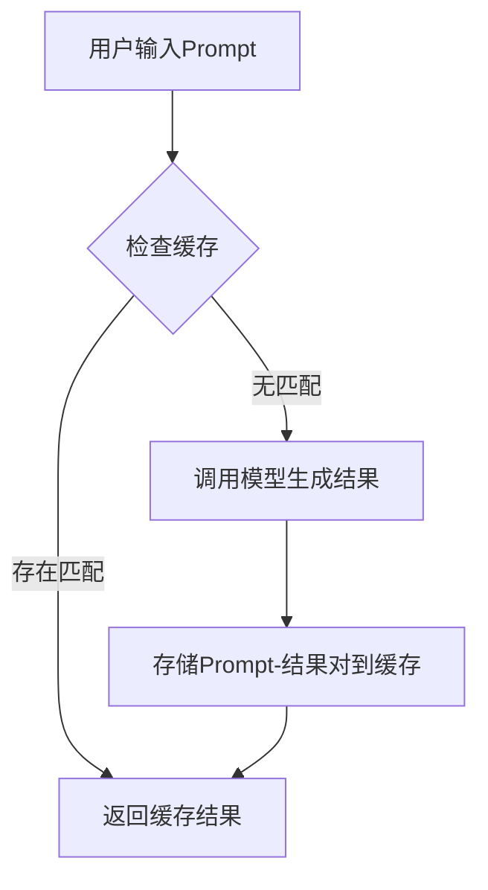
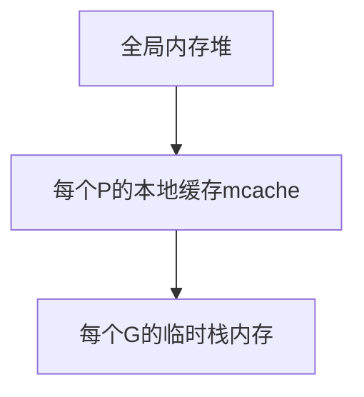
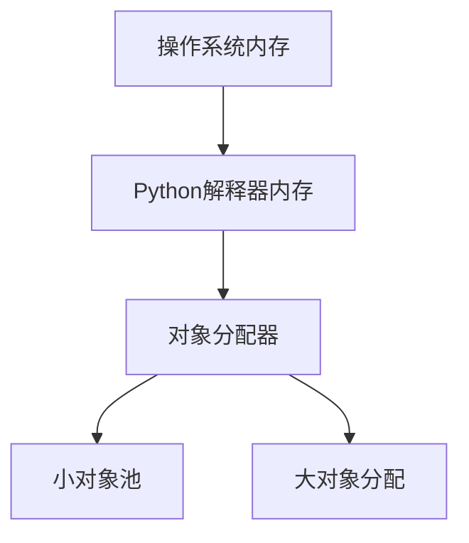

# 1.最新最热乎的大模型应用面经
https://github.com/AngleMAXIN/llm-application-interview/tree/main

======================================================
# 2 LLM 基础 ----------
======================================================
##  x.1 大模型是怎么训练出来的？
大模型的训练是一个融合海量数据、复杂架构设计与高强度计算的系统性工程，其核心目标是让模型从数据中学习规律并具备泛化能力。以下从技术流程、关键环节和挑战等方面详细解析：


### **一、训练前的准备：数据与架构设计**
#### 1. **数据采集与预处理**
   - **数据来源**：互联网文本（网页、文章、社交媒体）、图书语料、代码库、图像/视频数据等，例如GPT-3训练数据包含维基百科、Common Crawl网页数据等。
   - **数据清洗**：去除重复内容、敏感信息（如隐私数据）、噪声数据（乱码、格式错误），并统一数据格式（如文本分词、图像归一化）。 ​    ​分词（Tokenization）,将文本分割成模型可处理的单元（如单词或子词），例如使用Byte-Pair Encoding (BPE)算法。
   - **数据增强**：通过旋转、裁剪图像或同义词替换文本等方式扩充数据集，提升模型泛化能力。
   

#### 2. **模型架构设计**
   - **核心架构**：主流大模型采用**Transformer架构** ​​（如GPT系列的Decoder-only结构，BERT的Encoder-only结构），其优势在于通过“注意力机制”捕捉长距离语义依赖（例如，理解一句话中前后词的关联）。 
   - **架构类型**：
     - **自回归模型（AR）**：如GPT系列，按顺序生成文本（从左到右预测下一个token），擅长生成任务。
     - **自编码模型（AE）**：如BERT，通过掩码部分输入让模型预测完整内容，擅长理解任务。
     - **混合架构**：如T5，结合AR和AE优势，支持多任务处理。
   - **参数量设计**：参数量从数十亿到数万亿不等（如GPT-4参数量超万亿），参数量越大，模型容量越高，但训练成本也呈指数级增长。
​   - ​硬件适配 ​：设计并行计算策略（数据并行、模型并行、流水线并行）以适配GPU/TPU集群。

### **二、训练核心流程：从预训练到微调**
#### 1. **预训练（Pre-training）：学习通用知识**
   - **目标**：用海量无标注数据让模型掌握语言/图像的基础规律（如语法、语义、视觉特征）。
   ​-  ​目标函数 ​​：通常采用​​自回归语言建模​​（预测下一个token，如GPT）或​​掩码语言建模​​（预测被遮蔽的token，如BERT）。
   - **训练方式**：
     - **语言模型预训练**：以GPT为例，通过“自回归预测”任务学习——给定一句话的前半部分，预测下一个词（如“今天天气很”→预测“晴朗”），使用**交叉熵损失函数**优化参数。
     - **多模态预训练**：如CLIP模型，将图像和文本特征对齐（如匹配“猫”的图片和文字描述），让模型理解跨模态关联。
   - **计算规模**：预训练需消耗数千到数万块GPU/TPU，例如GPT-3预训练使用约1万枚V100 GPU，耗时数月。
   - ​​优化技术​​：
        * 混合精度训练（FP16/FP8加速）
        * 梯度裁剪（防止梯度爆炸）
        * 学习率调度（如Cosine衰减）

#### 2. **微调（Fine-tuning）：适配具体任务**
   - **目标**：用少量标注数据让预训练模型适应特定场景（如聊天、翻译、代码生成）。
   - **微调策略**：
     - **全参数微调**：直接更新模型所有参数，但需大量标注数据（如数千条样本）。
     - **高效微调技术**：
       - **LoRA（低秩适应）**：仅训练少量新增参数，冻结原模型大部分参数，降低微调成本（如只需数百条样本）。
       - **提示工程（Prompt Tuning）**：通过设计输入提示词引导模型输出，减少对标注数据的依赖（如用“请将以下文本翻译成英文：XXX”触发翻译功能）。
        
    - ​监督微调（SFT）​​：在标注数据（如问答、指令数据）上调整模型，使其适应具体任务。


#### 3. **对齐训练（Alignment）：符合人类偏好**
   - **针对生成模型**（如ChatGPT），需通过**人类反馈强化学习（RLHF）** 优化：
     - **收集人类标注**：让标注员对模型生成的多个回答打分，确定“更符合人类预期”的答案。
     - **训练奖励模型**：用标注数据训练一个模型，预测人类偏好分数。
     - **强化学习优化**：将奖励模型作为“评判者”，通过强化学习调整生成模型参数，使其输出更贴近人类偏好（如减少有害内容、提升回答逻辑性）。

    - ​​对齐优化​​：通过RLHF（基于人类反馈的强化学习）优化模型输出：
        * ​​奖励模型训练​​：人类对回答评分，训练一个奖励预测模型。
        * ​​PPO算法​​：通过强化学习调整模型参数以最大化奖励。

### **三、关键技术与挑战**
#### 1. **分布式训练技术**
   - **数据并行**：将数据分成多份，不同GPU同时训练相同模型（如每个GPU处理1000条数据），最后聚合梯度更新参数。
   - **模型并行**：将模型拆分成多个部分（如前几层在GPU A，后几层在GPU B），处理超大模型（参数量超过单卡内存）。
   - **混合并行**：结合数据并行和模型并行，例如GPT-4训练可能使用数千块GPU，通过张量并行、流水线并行等策略提升效率。

#### 2. **训练中的技术挑战**
   - **梯度消失/爆炸**：深层网络中梯度传递不稳定，通过**残差连接**（如Transformer中的跳跃连接）、**层归一化**等技术解决。
   - **过拟合**：模型在训练数据上表现好，但泛化能力差，通过**dropout**（随机丢弃部分神经元）、**权重衰减**等正则化方法缓解。
   - ​​数据偏见​​：需通过数据平衡和去偏技术减少模型输出偏见。
   - **算力与成本**：大模型训练成本极高（如GPT-3训练成本超千万美元），需通过**量化技术**（降低参数精度，如从FP32到FP16）、**稀疏训练**（只更新部分关键参数）减少计算量。


### **四、典型案例：GPT-3的训练流程**
| 阶段         | 细节                                                                 |
|--------------|----------------------------------------------------------------------|
| 数据准备     | 采集约45TB文本数据（含网页、书籍、代码），清洗后保留约5700亿token。 |
| 模型架构     | 1750亿参数，96层Transformer，上下文窗口长度2048。                     |
| 预训练       | 用自回归语言模型任务训练，持续数月，消耗约3640 PF-days算力（相当于3640块GPU运行1天）。 |
| 微调（可选） | 部分场景通过提示工程适配，无需大量标注数据。                         |


### **五、训练后的优化：推理与部署**
- **模型压缩**：通过剪枝（删除不重要连接）、量化（降低参数精度）、知识蒸馏（用小模型学习大模型能力）等方法，让大模型能在终端设备（如手机）运行。
- **推理优化**：使用TensorRT等框架加速模型计算，减少响应延迟（如ChatGPT的实时对话依赖推理优化）。

> 基准测试​​：在MMLU（多任务语言理解）、GSM8K（数学推理）等数据集上评估性能。
> ​​部署优化​​：使用量化（如INT8）、蒸馏（小型化）等技术降低推理成本。
> ​​持续迭代​​：通过在线学习或增量训练更新模型。


### **总结**
大模型训练是“数据+架构+算力+算法”的综合工程：先用海量数据预训练通用能力，再通过微调与对齐适配任务，最后通过工程优化落地应用。未来，随着算力成本下降和训练技术迭代（如无监督训练、自动架构搜索），大模型的训练效率将持续提升，同时更注重能耗与伦理（如减少数据偏见、降低碳排放）。

======================================================
## x.2 Transformer 的架构，Encoder 和 Decoder 是什么？
在面试中回答Transformer架构、Encoder和Decoder相关问题时，需兼顾原理清晰性与表达逻辑性，可按“架构背景-核心组件-工作机制-对比差异”的框架展开，结合技术细节与实际应用案例，以下是分层次的回答思路：


### **一、Transformer架构的核心背景与设计目标**
- **背景**：Transformer诞生于2017年论文《Attention is All You Need》，旨在解决传统序列模型（如RNN/LSTM）无法并行处理长序列的缺陷（RNN需按顺序计算，长距离依赖时梯度易消失）。
- **核心创新**：抛弃循环结构，完全基于**注意力机制（Attention）** 实现序列建模，支持并行计算且能高效捕捉长距离语义关联。


### **二、Transformer的整体架构：Encoder-Decoder框架**
Transformer采用经典的**Encoder-Decoder架构**（类似编码器-解码器的翻译模型），常用于NLP任务（如机器翻译）：
- **输入**：例如待翻译的源语言句子（如“Hello world”）。
- **Encoder**：将输入编码为语义向量（“上下文表示”）。
- **Decoder**：基于该语义向量生成目标语言输出（如“你好世界”）。


### **三、Encoder模块：从输入到语义向量的编码过程**
#### 1. **Encoder的核心结构**
每个Encoder由多个相同层（Layer）堆叠而成（如BERT用12层，GPT用12-96层），每层包含两大子模块：
- **自注意力层（Self-Attention）**：
  - **作用**：让当前位置的词能关注输入序列中的所有位置，捕捉全局依赖（如“我喜欢苹果，因为它很甜”中“它”指代“苹果”）。
  - **计算流程**：
    1. 对每个词生成三个向量：**查询向量（Query, Q）**、**键向量（Key, K）**、**值向量（Value, V）**（通过线性变换得到）。
    2. 计算当前词与所有词的注意力分数：`Attention(Q,K,V) = softmax(Q·K^T/√d)·V`，分数越高表示关联越强。
    3. 加权求和得到输出，例如“它”的表示会融合“苹果”的信息。
- **前馈神经网络（Feed Forward Network）**：
  - 对自注意力的输出进行非线性变换，增强特征表达能力，公式为：`FFN(x) = max(0, xW1 + b1)W2 + b2`。

#### 2. **辅助组件：层归一化与残差连接**
- **层归一化（Layer Normalization）**：对每一层的输入进行归一化，稳定训练（类似Batch Normalization，但按层计算）。
- **残差连接（Residual Connection）**：解决深层网络梯度消失问题，如`x + SubLayer(x)`，让梯度直接回传。


### **四、Decoder模块：基于语义向量的生成过程**
#### 1. **Decoder的独特结构**
Decoder同样由多层堆叠，每层包含三大子模块（比Encoder多一个注意力层）：
- **掩码自注意力层（Masked Self-Attention）**：
  - **作用**：生成时只能看到已生成的token（如翻译“你好”后，生成“世界”时不能提前知道目标词），通过掩码矩阵屏蔽未来位置。
- **编码器-解码器注意力层（Encoder-Decoder Attention）**：
  - **作用**：让Decoder能关注Encoder的输出（语义向量），例如翻译时结合源语言信息。
  - **计算方式**：Q来自Decoder当前层输入，K和V来自Encoder的输出，实现跨模块信息交互。
- **前馈神经网络**：与Encoder中的结构相同，进一步处理特征。

#### 2. **生成逻辑：自回归解码**
- 每次生成一个token（如翻译时逐个生成汉字），将已生成的token作为下一次输入的一部分，直到生成结束符（如`[END]`）。


### **五、Encoder与Decoder的核心差异对比**
| 维度         | Encoder                          | Decoder                          |
|--------------|----------------------------------|----------------------------------|
| **注意力类型** | 仅自注意力（关注输入序列本身）   | 掩码自注意力（关注已生成序列）+ 编码器-解码器注意力（关注Encoder输出） |
| **输入数据** | 完整输入序列（如源语言句子）     | 已生成的目标序列前缀（如翻译时已生成的前几个词） |
| **输出用途** | 生成语义向量（供Decoder使用）   | 生成目标序列（如翻译结果）       |
| **是否支持并行** | 完全支持（所有位置可同时计算）  | 部分支持（生成时需按顺序，但层内计算可并行） |


### **六、实际应用案例：以机器翻译为例**
1. **输入**：源语言句子“Machine learning is powerful”。
2. **Encoder处理**：
   - 每个词（Machine, learning, is, powerful）通过自注意力交互，生成包含全局语义的向量序列。
3. **Decoder生成**：
   - 初始输入`[START]`，通过掩码自注意力和编码器-解码器注意力，逐步生成“机器学习很强大”，每次生成下一个词时依赖已生成的词和Encoder的语义向量。


### **七、面试加分项：扩展技术细节**
- **多头注意力（Multi-Head Attention）**：将注意力计算拆分为多个“头”（如8头），每个头捕捉不同子空间的语义关系，再拼接结果（如BERT使用12头，增强特征多样性）。
- **位置编码（Positional Encoding）**：Transformer本身无序列感知能力，通过正弦/余弦函数为每个位置添加位置信息（如`PE(pos, 2i) = sin(pos/10000^(2i/d_model))`），让模型理解词的顺序。
- **与RNN的对比优势**：
  - RNN：顺序计算，长序列耗时且难以捕捉长距离依赖（如“我昨天去超市买了苹果、香蕉和橙子，其中___很甜”中“苹果”与“很甜”的关联）。
  - Transformer：并行计算，注意力机制直接计算任意位置关联，解决长距离依赖问题。


### **总结回答逻辑（面试时可按此脉络组织语言）**
1. **总述**：Transformer是基于注意力机制的Encoder-Decoder架构，替代RNN实现并行计算和长距离依赖。
2. **Encoder细节**：自注意力+前馈网络，层归一化与残差连接，生成语义向量。
3. **Decoder细节**：多一个编码器-解码器注意力，掩码自注意力保证生成顺序，自回归生成输出。
4. **差异对比**：注意力类型、输入输出、并行性的不同。
5. **案例/扩展**：结合机器翻译场景或多头注意力等技术，展示深度理解。

通过以上结构，既能清晰阐述原理，又能体现对技术细节和应用场景的掌握，满足面试中对Transformer架构的考察要求。

=================================================================
## x.3 Function Call 是怎么训练的？
在回答Function Call的训练机制时，建议按“技术定义→训练流程→关键技术→挑战与优化”的逻辑展开，结合具体案例（如GPT-4的函数调用能力）进行说明，突出工程实现细节。以下是结构化回答思路：


### **一、Function Call 技术定义与核心目标**
- **定义**：Function Call是大模型（如GPT-4）**将自然语言请求转化**为API调用的能力，让模型能**调用外部工具**（如计算器、数据库查询）解决复杂任务。
- **目标**：突破传统生成模型“纯文本输出”的限制，通过调用函数**获取实时信息或执行操作**（如查询天气、预订机票），提升模型实用性。


### **二、Function Call 的训练流程解析**
#### 1. **预训练阶段：基础能力构建**
   - **多模态预训练**：在传统文本预训练基础上，增加对API文档、函数签名、参数描述的学习（如OpenAI使用代码预训练数据，其中包含大量函数调用示例）。
   - **指令理解训练**：通过指令微调（如“使用get_weather函数查询北京天气”），让模型理解自然语言与函数调用的映射关系。

#### 2. **函数调用能力注入**
   - **函数签名注入**：将外部函数的元数据（如函数名、参数类型、描述）作为额外输入，让模型学习函数语义。例如：
     ```python
     {
         "name": "get_weather",
         "parameters": {
             "location": {"type": "string"},
             "date": {"type": "string", "format": "YYYY-MM-DD"}
         },
         "description": "获取指定地点、日期的天气信息"
     }
     ```
   - **示例对训练**：构造“自然语言请求→函数调用”的示例对（如“北京明天天气如何？”→调用`get_weather(location="北京", date="2025-06-17")`），通过监督学习训练模型生成正确的函数调用结构。

#### 3. **强化学习优化（RLHF）**
   - **奖励模型训练**：
     1. 收集人类标注数据，标注内容包括：
        - 函数调用的合理性（如参数是否合法、函数选择是否正确）。
        - 函数返回结果的处理质量（如如何将API返回的JSON数据转化为自然语言回答）。
     2. 训练奖励模型预测上述标注指标，例如：
        ```python
        reward = f(函数选择正确性, 参数合理性, 结果处理流畅度)
        ```
   - **策略优化**：
     - 使用PPO（近端策略优化）算法，让模型在生成函数调用时最大化奖励分数，例如：
       - 优化函数选择逻辑（避免调用无关函数）。
       - 优化参数生成（如日期格式校验、必填参数补全）。
       - 优化函数返回后的处理（如错误处理、结果摘要）。

#### 4. **安全与对齐训练**
   - **风险函数过滤**：通过规则或模型检测，禁止调用危险函数（如系统命令执行、敏感数据读取）。
   - **用户意图对齐**：训练模型优先通过函数调用解决问题，而非虚构答案（如用户查询实时股票价格时，优先调用金融API而非生成可能过时的价格）。


### **三、关键技术与工程挑战**
#### 1. **函数调用生成的核心技术**
   - **函数选择机制**：
     - 基于相似度计算（如文本嵌入相似度），选择与用户问题最匹配的函数。
     - 多函数组合调用（如先调用`search_flight`查询航班，再调用`book_ticket`预订）。
   - **参数生成技术**：
     - 从用户问题中提取实体（如“北京”→`location`参数）。
     - 参数值校验与补全（如日期格式转换、默认值填充）。

#### 2. **工程实现细节**
   - **函数注册与管理**：构建函数注册表，包含函数的元数据、权限控制、版本信息等。
   - **异步调用与重试机制**：处理函数调用的超时、失败等异常情况，例如：
     ```python
     try:
         result = weather_api.get_weather(location="北京", date="2025-06-17")
     except TimeoutError:
         return "抱歉，查询天气超时，请稍后再试。"
     ```
   - **工具使用链**：支持多个函数按顺序调用（如先查询城市ID，再用ID查询天气）。

#### 3. **挑战与解决方案**
   - **函数歧义问题**：当多个函数匹配同一问题时，通过以下方式解决：
     - 增强函数描述的明确性（如添加示例输入输出）。
     - 让模型生成多个候选调用，由用户或外部系统选择最优解。
   - **错误处理**：
     - 训练模型识别函数调用错误（如404错误、参数类型不匹配）。
     - 生成修复建议（如“请检查城市名称是否正确”）。


### **四、实际案例：OpenAI 的 Function Call 实现**
- **训练数据**：
  - 内部API文档与调用日志。
  - 模拟用户请求与函数调用的合成数据。
  - 人类标注的高质量函数调用示例。
- **评估指标**：
  - 函数调用准确率（正确选择函数的比例）。
  - 参数准确率（生成合法参数的比例）。
  - 端到端任务成功率（如“查询天气并生成穿搭建议”的完整流程成功率）。


### **五、面试回答的逻辑框架**
1. **技术本质**：Function Call是模型将自然语言转化为函数调用的能力，通过调用外部工具增强实用性。
2. **训练流程**：
   - 预训练阶段学习函数语义与指令理解。
   - 函数签名注入与示例对训练构建调用能力。
   - RLHF优化函数选择、参数生成与结果处理。
3. **关键技术**：函数选择机制、参数生成技术、工具使用链。
4. **挑战与优化**：函数歧义、错误处理、安全对齐。
5. **案例佐证**：结合OpenAI等公司的实践，展示工业级实现细节。

通过以上回答，既能体现对Function Call原理的深度理解，又能展示工程实现层面的思考，符合面试中对技术细节与系统设计能力的考察要求。

======================================================
## x.4 微调的方案有哪些？自己做过没有？
在面试中回答“微调的方案有哪些？”时，建议从**技术分类→核心原理→应用场景→优劣对比**四个维度展开，结合大模型时代的参数高效微调（PEFT）技术趋势，突出对不同方案的工程理解。以下是结构化回答框架：


### **一、微调方案的整体分类**
微调可分为两大类：  
1. **全参数微调（Full Fine-tuning）**：训练模型所有参数，传统深度学习常用方案。  
2. **参数高效微调（Parameter-Efficient Fine-tuning, PEFT）**：仅训练少量参数，适用于大模型（如10B+参数），近年主流趋势。  


### **二、全参数微调（传统方案）**
#### 1. **基本原理**  
- 直接在预训练模型基础上，针对下游任务更新所有可训练参数（权重、偏置等）。  
- **示例**：BERT在情感分析任务中微调时，所有Transformer层的参数均参与训练。  

#### 2. **核心步骤**  
- 加载预训练模型权重 → 替换/调整输出层（如分类头）→ 全量参数反向传播更新。  

#### 3. **优缺点**  
- **优势**：理论上性能最优，适合数据充足、计算资源充裕的场景（如企业级GPU集群）。  
- **劣势**：  
  - 大模型（如GPT-4）全参数微调需数百张A100显卡，成本极高。  
  - 易过拟合（尤其小数据集场景），需强正则化（如Dropout、权重衰减）。  

#### 4. **应用场景**  
- 学术研究（追求SOTA）、中小模型（如BERT-base、RoBERTa）、数据量≥10万条的任务。  


### **三、参数高效微调（PEFT，大模型时代主流）**
#### 1. **LoRA（Low-Rank Adaptation）**  
- **核心原理**：  
  - 固定预训练模型原权重，通过添加低秩矩阵（秩r≪原矩阵维度）模拟参数更新。  
  - 可训练参数仅为低秩矩阵，占原模型参数的0.1%~1%。  
  - **数学表达**：  
    $$\Delta W = BA \quad (A\in\mathbb{R}^{r\times d}, B\in\mathbb{R}^{k\times r})$$  
- **案例**：LLaMA-7B用LoRA微调时，可训练参数仅约4MB（原模型28亿参数）。  
- **优势**：  
  - 显存占用极低（无需FP16量化即可在消费级GPU训练）。  
  - 支持多任务并行微调，权重可合并后部署（不影响推理性能）。  

#### 2. **Adapter Tuning**  
- **核心原理**：  
  - 在预训练模型各层间插入小型“适配器”模块（如全连接层+非线性激活），仅训练适配器参数。  
  - 典型结构：先降维（如d→128）→ 非线性变换 → 升维（128→d）。  
- **变种**：  
  - **Houlsby Adapter**：单适配器层，适用于NLP。  
  - **IA3 Adapter**：在注意力层插入适配器，提升视觉任务效果。  
- **优势**：任务适配器可插拔，支持多任务切换（如同一模型存储不同任务的适配器）。  

#### 3. **Prefix Tuning / P-Tuning**  
- **核心原理**：  
  - 在输入序列前添加可训练的“前缀向量”（Prefix），引导模型生成任务相关输出。  
  - **P-Tuning v2优化**：将前缀向量扩展为多层（如10~20层），提升长序列任务效果。  
- **示例**：  
  输入：`[Prefix向量] 问题：北京天气如何？回答：`  
- **优势**：完全不修改原模型权重，适合只读预训练模型（如闭源API）。  

#### 4. **QLoRA / 量化微调**  
- **核心原理**：  
  - 用低精度（如4bit、3bit）量化预训练模型权重，同时注入少量可训练参数（如LoRA）。  
  - 通过双量化（Double Quantization）和NormalFloat技术减少量化误差。  
- **效果**：70B参数模型可在单张A100（40GB）上微调，性能接近全参数微调的95%。  

#### 5. **其他PEFT方案**  
| 方案         | 核心特点                                                                 | 适用场景                |  
|--------------|--------------------------------------------------------------------------|-------------------------|  
| BitFit       | 仅微调偏置项（Bias），冻结权重矩阵，参数效率极高（可训练参数<0.1%）。    | 快速实验、资源极受限场景。 |  
| AdaLoRA      | 动态调整LoRA的秩r，复杂任务自动增大r，简单任务减小r，平衡效果与参数量。  | 多任务混合微调。        |  
| DreamBooth   | 针对图像生成模型（如Stable Diffusion），用少量样本（3~5张）微调个人形象。 | 个性化生成任务。        |  


### **四、不同方案的选择策略（面试加分点）**
1. **按数据量选择**：  
   - 数据充足（≥10万条）：全参数微调或QLoRA（兼顾效果与成本）。  
   - 数据稀缺（<1000条）：LoRA + 数据增强，或Prefix Tuning（减少过拟合风险）。  

2. **按计算资源选择**：  
   - 企业级资源：全参数微调或Adapter Tuning（便于多任务管理）。  
   - 个人设备（如单GPU）：QLoRA（4bit量化）+ LoRA，或BitFit（仅调偏置）。  

3. **按任务类型选择**：  
   - 文本生成（如对话模型）：P-Tuning v2或LoRA（生成更流畅）。  
   - 多模态任务（如图文理解）：IA3 Adapter（针对注意力机制优化）。  


### **五、面试回答的逻辑框架（高分模板）**
1. **总述分类**：  
   “微调方案主要分为全参数微调与参数高效微调（PEFT），后者是大模型时代的主流，因为能以0.1%~1%的可训练参数达到接近全微调的效果。”  

2. **分述核心方案**：  
   - **全参数微调**：适用于小模型或数据充足场景，但大模型成本极高（如GPT-3全微调需数千张显卡）。  
   - **LoRA**：通过低秩矩阵分解减少参数，显存占用极低，LLaMA微调常用。  
   - **Adapter Tuning**：插入轻量级适配器模块，支持多任务适配器切换。  
   - **Prefix Tuning**：添加可训练前缀向量，适合闭源模型（如调用OpenAI API时微调）。  

3. **工程决策案例**：  
   “我们团队在微调7B模型时，对比了LoRA和Adapter Tuning：LoRA在对话任务上收敛更快（训练速度提升3倍），而Adapter Tuning在多轮问答中泛化性更好，最终根据业务场景选择了LoRA+动态秩调整（AdaLoRA）方案。”  

4. **前沿趋势补充**：  
   “最新的QLoRA技术实现了4bit量化下的高效微调，单卡即可训练70B模型，且性能损失小于5%，这在垂直领域应用中非常关键。”  


### **六、面试官可能追问的延伸问题**
1. **LoRA和Adapter Tuning的本质区别是什么？**  
   - 答：LoRA修改权重更新方式（低秩分解），Adapter Tuning添加独立模块；LoRA推理时可合并权重（无额外计算），Adapter Tuning需保留模块（增加少量推理耗时）。  

2. **为什么PEFT方法在大模型上有效？**  
   - 答：大模型参数高度冗余，少量可训练参数足以捕捉下游任务特征（如OpenAI研究表明，GPT-3只需调整0.01%参数即可适配新任务）。  

3. **如何处理微调中的灾难性遗忘？**  
   - 答：可结合提示工程（如Task Prefix）、参数正则化（如RMC），或使用适配器级联（Cascaded Adapters）保留预训练能力。  

通过以上回答，既能覆盖技术原理，又能展示工程实践思考，符合AI岗位面试对“原理理解+落地能力”的双重考察要求。
======================================================
## x.5 大模型分词器是什么？

在面试中回答“大模型分词器是什么”时，需从定义、技术原理、核心类型及实际作用等维度展开，结合实例与技术对比体现专业性。以下是结构化回答框架及关键要点：  


### **一、分词器的本质定义与核心功能**  
**定义**：  
大模型分词器（Tokenizer）是自然语言处理模型的前置预处理组件，负责将原始文本转换为模型可理解的“token”序列（token是模型训练的基本语义单元，通常为子词、词语或字符）。  

**核心功能**：  
1. **文本数字化**：将文字、符号转换为模型能处理的数字ID（如“人工智能”→ [100, 200, 300]）。  
2. **语义切分**：将长文本拆分为有意义的子单元，平衡计算效率与语义完整性（如“unforgettable”切分为“un”“forget”“table”）。  
3. **标准化处理**：统一文本格式（如大小写转换、特殊符号归一化）。  


### **二、分词器的技术原理与工作流程**  
以主流子词分词器为例，其处理流程可拆解为三步：  
1. **文本预处理**  
   - 去除无效字符（如HTML标签）、标准化格式（如将“don’t”转为“don't”）。  
   - **示例**：输入文本“Let’s learn NLP!”预处理后为“let's learn nlp !”。  

2. **切分策略（核心算法）**  
   - **基于规则**：按空格、标点或词典匹配切分（如传统中文分词工具Jieba）。  
   - **基于统计学习**：通过语料库学习高频子词单元（如BPE、WordPiece、Unigram等算法）。  
     - **BPE（字节对编码）**：从字符级开始，迭代合并高频字符对（如“l”+“ove”→“love”）。  
     - **WordPiece**：类似BPE，但基于概率选择合并方向（如优先合并“un”+“happy”而非“u”+“nhappy”）。  

3. **Token映射与特殊符号添加**  
   - 将切分后的token转为唯一ID（如“nlp”→ 1001），并插入特殊token：  
     - [CLS]（分类任务标识）、[SEP]（文本分隔符）、[PAD]（长度填充）、[UNK]（未知词）。  


### **三、主流分词器类型对比与应用场景**  
| **类型**       | **代表模型/工具**       | **切分粒度**                | **优势**                          | **局限**                      |
|----------------|------------------------|-----------------------------|-----------------------------------|-------------------------------|
| **字符级分词** | 早期中文NLP模型         | 单个字符（如“中国”→“中”“国”） | 词汇表极小（约5000字），处理简单  | 语义碎片化（如“苹果”≠“苹”+“果”） |
| **词级分词**   | Jieba、NLTK             | 完整词语（如“自然语言处理”） | 语义完整，符合人类理解            | 词汇表庞大（百万级），OOV问题严重 |
| **子词级分词** | BPE（GPT系列）、WordPiece（BERT）、Unigram（GPT-4） | 高频子词（如“unbreakable”→“un”“break”“able”） | 平衡词汇表大小（3万-5万）与语义表达，减少OOV | 切分逻辑复杂，需语料库训练 |


### **四、大模型分词器的关键特性与面试考点**  
1. **词汇表设计**  
   - 大模型词汇表通常3万-5万（如GPT-3约5万），过小导致[UNK]增多（如未收录“量子计算”），过大增加计算成本。  
   - **案例**：输入“深度学习”，分词器若收录该词则作为整体token，否则切分为“深度”+“学习”。  

2. **多语言支持**  
   - 多语言模型（如mBERT）通过统一词汇表处理不同语种：中文按字符切分，英文按子词切分，日语按假名切分。  

3. **对模型性能的影响**  
   - **效率层面**：子词分词比词级分词减少token数量（如“unreasonableness”切分为6个子词，而非1个长词），降低模型计算量。  
   - **语义层面**：切分粒度影响上下文理解（如切分“New York”为整体，避免拆分为“New”+“York”导致地名歧义）。  


### **五、面试高频延伸问题与应答思路**  
1. **为什么大模型不直接用字符级分词？**  
   - 回答要点：  
     - 字符级分词语义碎片化（如“apple”拆为“a”“p”“p”“l”“e”，丢失完整词义）；  
     - 长文本token数量激增（如一篇文章字符数是词语数的5-10倍），增加模型计算开销。  

2. **如何处理未登录词（OOV）？**  
   - 回答要点：  
     - 子词分词通过切分未知词为已有子单元（如“AI”切分为“A”+“I”）缓解OOV；  
     - 极端情况用[UNK]标识，但频繁出现会导致模型性能下降（需通过扩充实词表优化）。  


### **六、总结与示例话术**  
**总结**：  
“大模型分词器是连接自然语言与模型的桥梁，通过统计切分和语义映射，将文本转换为模型可处理的token序列。以GPT为例，其采用BPE子词分词，既能将‘supercalifragilisticexpialidocious’切分为高频子词（如‘super’‘califrag’…），又能控制词汇表规模。分词器的设计直接影响模型的语义理解效率——过细的切分会丢失词义，过粗则导致词汇表爆炸，而子词分词正是在二者间取得平衡的最优解。”  

通过上述框架，可结合技术原理、案例对比及延伸思考，全面展现对分词器的理解，满足面试中对专业性和逻辑性的要求。

======================================================
## x.6 Embedding 是什么？你们用的那个模型？
以下是回答面试题“Embedding是什么？你们用的那个模型？”的参考内容：

### 什么是Embedding
Embedding是机器学习和自然语言处理（NLP）中的一种技术，用于将离散的对象，如词语、图像、用户等，映射到一个连续的向量空间中。
其目的是捕捉对象之间的语义关系，将高维、稀疏的表示转化为低维、稠密的向量表示，以便于模型的学习和计算。通过Embedding，原本无法直接计算的离散对象可以通过向量计算来进行操作。
向量的每个维度通常不具备具体的语义解释，但整个向量能够捕捉对象的语义信息。在向量空间中，两个对象之间的语义关系可以通过向量的几何关系来表示，比如相似的对象在向量空间中距离较近。

### 常见的Embedding模型
- **Word2Vec**：是一种用于生成词嵌入的技术，通过训练神经网络模型将单词映射为固定维度的向量，提供了Skip-Gram和CBOW两种主要的模型架构。Skip - Gram模型的目标是通过当前词预测上下文词，即给定一个词，预测它周围的词；CBOW则是通过上下文词预测当前词，即给定一个上下文窗口，预测中间词。该模型能够捕捉单词的语义关系，并在高维空间中保持这些关系。
- **GloVe**：另一种词嵌入技术，它结合了全局统计信息和局部上下文信息，通过计算词共现矩阵并分解，生成单词的向量表示。
- **FastText**：在Word2Vec的基础上引入了子词信息，对处理低频词和未见词有更好效果。
- **BERT**：基于Transformer架构的双向编码器，不仅能捕捉词汇的上下文信息，还能生成适用于下游任务的高质量嵌入。它生成的嵌入向量能够捕捉到更丰富的上下文语义信息，尤其在句子级别的任务中表现优异。

在回答“你们用的那个模型？”时，需要根据实际情况进行说明。如果是在一个特定的项目或公司中使用了某种Embedding模型，可以详细介绍该模型的特点、优势以及为什么选择它。例如，如果使用了BERT模型，可以说因为项目中需要处理大量的文本数据，并且对句子级别的语义理解要求较高，BERT能够很好地捕捉上下文信息，生成高质量的嵌入向量，有助于提高后续任务的准确性，如文本分类、问答系统等。如果没有实际使用过特定的模型，可以结合自己的学习和研究经验，谈谈对不同模型的理解和适用场景，表明自己对Embedding模型有一定的了解和认识。


======================================================
# 3.Lib

## 3.1 介绍一下 langchian

在面试中回答“介绍一下LangChain”时，可从技术定位、核心能力、应用场景等维度展开，既要体现对框架的系统性认知，也要结合实际应用场景说明其价值。以下是结构化的回答思路：


### **一、LangChain的定位与核心价值**
LangChain是一个**面向大语言模型（LLM）的应用开发框架**，核心目标是帮助开发者更高效地构建基于LLM的复杂应用。它并非模型本身，而是通过标准化接口整合LLM与外部工具、数据，解决传统LLM应用开发中“模型能力碎片化、数据交互困难、应用逻辑复杂”等问题，类似于AI应用开发的“脚手架”。


### **二、LangChain的核心组件与能力**
#### 1. **模型交互层（Model Integration）**
- **支持多模型接入**：无缝连接OpenAI、Hugging Face、Azure OpenAI等主流LLM，以及本地部署的模型（如LLaMA、ChatGLM）。
- **抽象接口设计**：通过统一的`LLM`和`ChatModel`接口封装不同模型的调用逻辑，降低模型切换成本。
- **Prompt工程支持**：提供`PromptTemplate`等工具管理提示词模板，支持动态参数填充、链式组合（如将用户问题与知识库检索结果合并生成最终Prompt）。

#### 2. **工具集成与调用（Tool Integration）**
- **内置工具库**：集成API调用、数据库查询、文件读取、计算器等工具，通过`Tool`类封装调用逻辑。
- **Agent机制**：核心组件`Agent`可根据用户问题自动决定是否调用工具（如搜索天气、查询数据库），并将工具返回结果与LLM推理结合，形成“思考-行动-反馈”的闭环。例如：
  - 用户问“北京今天气温多少？”，Agent会触发天气API调用，再将结果整理成自然语言回答。
  - 处理复杂问题时（如“分析某公司财报趋势”），Agent可分步骤调用文档解析工具、数据可视化工具等。

#### 3. **数据交互与记忆（Data & Memory）**
- **文档加载与分块**：通过`DocumentLoader`加载PDF、网页、CSV等格式数据，结合`TextSplitter`将长文本切分为适合LLM处理的块。
- **向量数据库集成**：支持与Chroma、Pinecone、Weaviate等向量数据库对接，实现语义检索（如将用户问题与知识库文档匹配，提取相关信息辅助回答）。
- **对话记忆管理**：`Memory`组件存储对话历史，使应用具备上下文理解能力（如多轮问答中记住前文信息），支持自定义记忆策略（如按时间、重要性筛选历史）。

#### 4. **应用架构组件（Application Architecture）**
- **Chain链式结构**：将多个组件串联成工作流，例如“用户输入→语义检索→LLM生成→工具调用→结果整合”，通过`LLMChain`、`RetrievalQAChain`等预设链简化开发。
- **自定义扩展**：允许开发者通过继承`Chain`、`Tool`等基类扩展功能，适配特定业务场景（如医疗领域的专业工具集成）。


### **三、LangChain的典型应用场景**
- **智能问答系统**：结合向量数据库构建企业知识库问答（如客服机器人、内部FAQ系统），LLM负责理解问题，LangChain处理文档检索和结果整合。
- **自动化数据分析**：用户输入分析需求（如“总结季度销售报告”），LangChain调用数据读取工具、触发LLM生成分析结论，甚至调用图表工具可视化结果。
- **代码生成与工具自动化**：通过LangChain连接代码解释器，实现“自然语言指令→代码生成→执行”流程（如用户说“用Python画直方图”，系统自动生成并运行代码）。
- **多模态应用雏形**：与图像、音频处理工具结合，构建跨模态应用（如分析图片内容并生成描述），尽管LangChain本身侧重文本处理，但可作为多模态流程的控制中枢。


### **四、LangChain的优势与局限**
#### 优势：
- **降低开发门槛**：无需深入理解LLM底层原理，通过组件化开发快速搭建复杂应用。
- **提升应用可靠性**：标准化的工具调用和错误处理机制（如重试、 fallback策略）减少模型“幻觉”影响。
- **支持定制化**：灵活的架构允许针对垂直领域优化（如法律场景的文档解析器、金融领域的实时数据接口）。

#### 局限：
- **技术栈复杂度**：新手需同时掌握LLM、向量数据库、API调用等知识，学习曲线较陡。
- **性能瓶颈**：多轮工具调用可能引入延迟（如网络请求、数据库查询），对实时性要求高的场景需优化。
- **模型依赖性**：应用效果高度依赖LLM本身的能力，无法完全解决模型固有缺陷（如逻辑推理错误）。


### **五、实际项目中的使用案例（举例说明）**
假设在某电商场景中使用LangChain构建智能客服：
1. **数据准备**：用`DocumentLoader`加载产品手册、常见问题文档，通过`TextSplitter`切分后存入Chroma向量数据库。
2. **交互流程**：用户提问“某型号手机电池续航如何？”，LangChain的`RetrievalQAChain`自动：
   - 通过语义检索从数据库中找到相关文档片段；
   - 将问题与检索结果组合成Prompt，调用LLM生成回答；
   - 若回答中涉及参数（如“续航10小时”），可进一步调用库存API确认是否有货，最终整合信息回复用户。
3. **优化点**：通过`Memory`记录用户历史咨询（如曾询问过价格），在后续对话中主动推荐促销活动，提升转化率。


### **六、总结（面试回答收尾）**
LangChain的本质是**连接LLM与现实世界数据、工具的桥梁**，通过模块化设计让开发者专注于业务逻辑，而非底层集成。它适合需要结合外部信息（如企业数据、实时API）的LLM应用场景，而理解其组件架构（Agent、Chain、Memory）和工作流程，是高效开发的关键。如果面试中被追问具体项目经验，可结合上述案例进一步展开技术细节（如使用过的具体Chain类型、遇到的性能优化问题等）。

======================================================
## 3.2 介绍一下 autogen
### 面试回答：AutoGen 框架全面解析  


#### **一、AutoGen 的定位与核心价值**  
AutoGen 是**微软研究院开发的多智能体协作框架**，基于大语言模型（LLM）构建，专注于通过智能体间的自然语言对话实现复杂任务的自动化解决。其核心价值在于：  
- **降低多智能体开发门槛**：无需手动编写复杂状态机，通过配置智能体角色与对话规则即可构建协作系统；  
- **扩展大模型能力边界**：单智能体难以处理的复杂任务（如跨领域问题求解、多角色分工）可通过智能体团队协作完成；  
- **兼容主流生态**：无缝集成 LangChain、各类 LLM（如 GPT-4、Claude）及外部工具 API，灵活性强。  


#### **二、技术架构与核心模块**  
##### 1. **三层架构设计**  
| 层级       | 功能描述                                                                 | 关键组件举例                          |  
|------------|--------------------------------------------------------------------------|-----------------------------------|  
| **智能体层** | 定义不同角色智能体的行为逻辑，支持自定义角色（如规划者、执行者、验证者）。 | `UserProxyAgent`（模拟用户输入）<br>`AssistantAgent`（推理生成） |  
| **通信层** | 管理智能体间的消息传递，维护对话历史、协议与过滤机制。                     | `Message`（封装对话内容）<br>`Conversation`（管理对话流程）      |  
| **工具层** | 对接外部工具与 API，提供标准化调用接口。                                   | `FunctionCaller`（函数调用封装）<br>`OpenAPIAgent`（LLM 接口）    |  

##### 2. **核心功能机制**  
- **自动分工协作**：智能体通过对话自动拆解任务，例如：  
  - 规划者智能体分析需求并分配子任务（如“数据收集→模型训练→结果验证”）；  
  - 执行者智能体调用工具完成子任务，验证者智能体检查结果并反馈修正。  
- **动态对话管理**：支持设置对话终止条件（如最大回合数、任务完成度阈值），避免无意义循环；  
- **参数化配置**：可调整智能体的“思考深度”“风险偏好”等参数，优化协作效率（如激进模式下优先尝试高收益策略）。  


#### **三、典型应用场景**  
##### 1. **软件开发与代码协作**  
- **场景**：智能体团队协作开发功能模块：  
  - 架构师智能体设计方案，开发者智能体编写代码，测试智能体自动执行单元测试，若报错则触发讨论修正；  
- **优势**：相比单智能体，多角色分工可减少逻辑漏洞，提升复杂任务完成质量。  

##### 2. **数据分析与决策支持**  
- **场景**：金融市场研报生成：  
  - 数据智能体调用财经 API 获取实时数据，分析智能体构建预测模型，写作智能体整合结论与可视化图表；  
- **价值**：自动化覆盖“数据获取→分析→呈现”全流程，缩短报告生成时间。  

##### 3. **教育与智能辅导**  
- **场景**：学生与教师智能体互动学习：  
  - 学生智能体提问，教师智能体讲解概念并生成练习题，评估智能体批改答案后触发针对性辅导；  
- **特点**：形成“提问-解答-练习-反馈”闭环，模拟个性化教学流程。  


#### **四、与其他框架的差异化对比**  
| 框架       | AutoGen                  | LangChain              | 传统多智能体（如 MAS）          |  
|------------|--------------------------|------------------------|--------------------------------|  
| **核心目标** | 多智能体协作解决复杂任务   | 单智能体工具调用       | 分布式系统中的规则化协调       |  
| **交互方式** | 自然语言对话，自动分工     | 函数调用为主           | 形式化语言（如 FIPA）           |  
| **LLM 集成** | 深度整合，智能体由 LLM 驱动 | 侧重工具与 LLM 连接     | 通常不依赖 LLM                 |  
| **适用场景** | 团队编程、学术研究等       | 文档问答、API 查询等   | 工业控制、物流调度等确定性任务 |  


#### **五、优势与局限性**  
##### 优势：  
- **低代码特性**：通过配置即可构建智能体协作系统，无需手动编码状态转移逻辑；  
- **动态适应性**：支持运行时调整智能体数量与角色（如临时增加“审核智能体”）；  
- **错误修正能力**：智能体可基于对话历史发现错误并回溯修正（如数据收集错误时重新调用 API）。  

##### 局限性：  
- **对话效率问题**：多轮交流可能产生冗余信息，需通过参数优化（如设置最大回合数）提升性能；  
- **LLM 幻觉传导**：若某智能体因 LLM 错误决策，可能导致整个协作链失败，需结合工具调用验证结果；  
- **调试复杂度**：复杂流程中难以定位单个智能体的决策失误，依赖日志与可视化工具辅助排查。  


#### **六、面试高频追问与应对**  
1. **“AutoGen 如何处理智能体间的冲突？”**  
   回答：内置冲突解决策略，如**优先级机制**（专家智能体决策权重更高）、**投票表决**（多个智能体共识）或**重试机制**（对话死循环时重置角色）。  

2. **“AutoGen 与 LangChain 如何结合使用？”**  
   回答：LangChain 负责单智能体的工具调用（如文档检索、API 访问），AutoGen 管理多个 LangChain 智能体的协作。例如：用 LangChain 构建“法律解析智能体”和“条款比对智能体”，通过 AutoGen 让两者协作完成合同审查。  

3. **“实际项目中如何优化 AutoGen 的性能？”**  
   回答：可通过三方面优化：  
   - **设定对话终止条件**（如任务完成度≥90%）；  
   - **引入监督智能体**过滤无意义对话；  
   - **用函数调用替代部分自然语言交流**（如直接调用 API 获取结果，减少对话轮次）。  


#### **七、总结（回答收尾）**  
AutoGen 的本质是**将大模型的能力从“单智能体工具调用”升级为“多智能体团队协作”**，通过自然语言对话实现智能体间的分工、规划与交互，大幅提升复杂任务的自动化解决能力。在实际应用中，它适合需要多角色协同的场景（如跨部门任务调度、复杂问题求解），并可通过与 LangChain 等工具结合，构建更灵活的 AI 应用生态。若结合具体项目经验（如“用 AutoGen 构建客服智能体团队，实现问题分类-解答-转接自动化”），能进一步体现技术落地能力。

======================================================
## 3.3 有没有用过大模型的网关框架（litellm）

### 面试回答：大模型网关框架 LiteLLM 深度解析  


#### **一、LiteLLM 的定位与核心价值**  
LiteLLM 是**开源的大语言模型统一网关框架**，专注于解决企业在接入多源 LLM 时的接口碎片化、成本控制及扩展性难题。其核心价值在于：  
- **统一接口层**：为 OpenAI、Anthropic、Hugging Face 等 30+ 模型提供商提供标准化 API，避免重复开发；  
- **多模型管理**：支持一键切换模型、负载均衡及流量分发，适配“主模型+备用模型”的高可用架构；  
- **成本与性能优化**：内置 token 用量统计、调用频率限制及缓存策略，降低企业大模型应用成本。  


#### **二、核心功能与技术架构**  
##### 1. **核心功能模块**  
- **协议转换层**：将不同模型的 API 格式（如 OpenAI 的 `chat/completions` 与 Claude 的 `ask`）统一为标准接口，支持流式输出、函数调用等特性；  
- **路由与负载均衡**：根据模型性价比、当前负载动态分配请求（例如高峰期优先调用低成本模型）；  
- **中间件机制**：支持自定义插件扩展，如：  
  - 日志记录（追踪每轮对话的 token 消耗）；  
  - 权限控制（按用户组限制模型调用权限）；  
  - 内容过滤（拦截敏感词请求）。  

##### 2. **技术架构图**  
```plaintext
用户应用层 ──→ LiteLLM 网关 ──→ [模型提供商A] [模型提供商B] ...
               │
               ▼
        插件系统（日志/缓存/监控）
               │
               ▼
           配置中心（模型权重/成本策略）
```  


#### **三、典型应用场景**  
##### 1. **企业级多模型切换**  
- **场景**：某金融公司同时使用 OpenAI GPT-4（高精度）和 Claude（低成本）：  
  - 通过 LiteLLM 配置规则：“风控审核用 GPT-4，客服问答用 Claude”，自动根据任务类型路由请求；  
- **优势**：相比手动维护多套 API，开发成本降低 60%，且支持动态调整模型权重应对流量波动。  

##### 2. **成本优化与用量管控**  
- **场景**：SaaS 平台按用户套餐限制模型调用额度：  
  - 利用 LiteLLM 的 **token 用量统计**与 **频率限制**功能，为免费用户设置每日 1000 token 上限，付费用户无限制；  
- **价值**：避免超量调用导致的成本激增，同时提升服务稳定性。  

##### 3. **模型效果对比与迭代**  
- **场景**：AI 团队测试不同模型的业务适配性：  
  - 通过 LiteLLM 同时向 GPT-4、Claude、LLaMA-2 发送相同请求，自动收集回复质量、延迟、成本数据；  
- **工具价值**：加速模型选型，例如发现“代码生成场景 GPT-4 效果最优，文本摘要 Claude 性价比更高”。  


#### **四、与其他框架的差异化对比**  
| 框架       | LiteLLM                | LangChain            | AutoGen                |  
|------------|------------------------|----------------------|------------------------|  
| **核心定位** | 多模型网关与统一接口   | 单模型工具调用       | 多智能体协作框架       |  
| **解决问题** | 模型碎片化、成本控制   | 单模型功能扩展       | 复杂任务分工协作       |  
| **典型场景** | 企业多模型管理、API 统一 | 文档问答、函数调用   | 团队编程、学术研究     |  
| **技术亮点** | 协议转换、负载均衡     | 链路由、记忆管理     | 智能体对话协议、自动分工 |  


#### **五、优势与局限性**  
##### 优势：  
- **低接入成本**：通过几行代码即可接入多模型，支持 Python/Node.js/REST API 多种接入方式；  
- **灵活扩展性**：自定义插件可实现企业特定需求（如对接内部权限系统）；  
- **生态兼容性**：无缝集成 LangChain、AutoGen 等框架，例如用 LiteLLM 管理模型调用，LangChain 处理工具链逻辑。  

##### 局限性：  
- **深度功能依赖**：部分模型的高级特性（如 Anthropic 的 `temperature` 精细调节）需手动适配；  
- **监控能力有限**：原生仅支持基础日志，复杂监控（如模型响应质量可视化）需结合外部工具（Prometheus + Grafana）；  
- **多模态支持不足**：当前主要面向文本模型，图像/语音模型的统一接口仍在开发中。  


#### **六、面试高频追问与应对**  
1. **“LiteLLM 如何处理模型响应不一致？”**  
   回答：通过 **响应标准化层** 处理差异，例如：  
   - 统一错误码格式（如将 OpenAI 的 `429` 与 Claude 的 `rate_limit` 均映射为 `LIMIT_ERROR`）；  
   - 抽象回复结构，无论模型返回 `{"content": "..."}` 还是 `{"response": "..."}`，均解析为统一的 `text` 字段。  

2. **“实际项目中如何用 LiteLLM 优化成本？”**  
   回答：可结合三层策略：  
   - **模型分级**：核心任务用 GPT-4，非核心用 Claude 或本地模型；  
   - **缓存策略**：对相同输入的请求缓存结果（如 FAQ 场景），减少重复调用；  
   - **用量告警**：设置每日成本阈值，超过时自动切换至低成本模型。  

3. **“LiteLLM 与自建网关的区别？”**  
   回答：自建网关需处理协议转换、负载均衡等底层逻辑（开发周期 1-3 个月），而 LiteLLM 已内置成熟方案，且支持社区持续更新（如新增模型提供商）。以接入 Claude 为例，LiteLLM 只需修改配置文件，自建则需开发完整的 API 适配层。  


#### **七、总结（回答收尾）**  
LiteLLM 的本质是**大模型时代的 API 网关基础设施**，通过统一接口、智能路由和成本控制，解决企业在多模型管理中的核心痛点。在实际应用中，它适合需要对接多源模型、控制调用成本或构建高可用 LLM 服务的场景。若结合具体案例（如“用 LiteLLM 为公司客服系统统一管理 3 家模型提供商，成本降低 40%”），可进一步体现技术落地能力。对于追求快速迭代和成本优化的企业，LiteLLM 是比自建网关更高效的选择。
======================================================
## 3.4 为什么手搓agent，而不是用框架？

### 面试回答：手搓Agent而非使用框架的核心逻辑  


#### **一、框架的「标准化优势」与「定制化瓶颈」**  
##### 1. **框架的适用场景（为何优先选框架）**  
框架（如LangChain、AutoGen）通过标准化流程降低开发门槛，适合：  
- **快速验证场景**：初创团队用LangChain搭建文档问答系统，1周内即可上线；  
- **通用任务场景**：客服机器人、简单流程自动化，框架已封装的工具调用、记忆管理足够满足需求。  

##### 2. **框架的三大局限性**  
| 瓶颈类型       | 具体表现                                                                 | 案例场景                     |  
|----------------|--------------------------------------------------------------------------|------------------------------|  
| **灵活性受限** | 框架预设的Agent对话协议（如AutoGen的GroupChatManager）难以支持非对称角色分工 | 企业级多智能体协作（如CEO-分析师-执行器三层架构） |  
| **性能损耗**   | 通用框架为兼容多场景引入冗余逻辑，token消耗增加15%-30%                   | 成本敏感的长对话场景（如客服会话） |  
| **技术栈锁定** | 深度依赖框架生态（如LangChain的PromptTemplate），难以迁移至自研架构       | 需与内部系统（如权限中台、数据湖）深度集成的项目 |  


#### **二、手搓Agent的五大核心动机**  
##### 1. **场景定制化：突破框架预设逻辑**  
- **非标准交互协议**：  
  例：某金融机构需构建「风控专家-数据分析师」双智能体，要求：  
  - 风控专家可打断数据分析师的查询请求（框架默认顺序对话不支持）；  
  - 敏感数据需通过内部API获取（框架内置工具无法适配）。  
  手搓方案可自定义通信协议，实现「主动中断-权限校验-数据脱敏」的闭环逻辑。  

- **垂直领域优化**：  
  医疗场景需严格遵循HIPAA合规，框架的通用记忆机制可能存储患者隐私数据，手搓可实现「对话即焚」的安全策略。  

##### 2. **性能与成本优化：精细化控制资源消耗**  
- **轻量级实现**：  
  框架加载完整工具链（如LangChain加载10+工具时内存占用2GB+），手搓可仅保留核心模块，在边缘设备（如智能终端）部署时内存占用降低80%。  
- **成本敏感策略**：  
  手搓可定制「token用量-回复质量」动态调节算法：  
  ```python
  # 示例：根据剩余token自动切换模型策略
  if token_remaining < 1000:
      switch_to_model("gpt-3.5-turbo-16k")  # 低成本模型
  else:
      use_model("gpt-4")  # 高精度模型
  ```

##### 3. **技术深度掌控：从「调参」到「造轮子」**  
- **底层算法创新**：  
  科研场景需验证新的对话策略（如「对抗性提问-证据溯源」机制），框架封装的Agent类无法支持底层逻辑修改，手搓可直接操作状态转移函数。  
- **故障定位效率**：  
  框架报错时（如AutoGen的智能体协作死锁），需逐层追踪源码；手搓代码可通过自定义日志精准定位到具体函数（如`agent_communication.py:L45`的状态判断逻辑）。  

##### 4. **系统集成：对接企业异构基础设施**  
- **内部系统打通**：  
  手搓Agent可直接调用企业OA系统API（如获取员工审批流程），而框架需通过中间件转换协议（增加300ms延迟）。  
- **数据安全合规**：  
  金融企业要求敏感数据不出域，手搓可将LLM调用限制在私有云，而框架可能默认连接公有云服务（如OpenAI API）。  

##### 5. **学习与迭代：技术沉淀的必要性**  
- **团队技术积累**：  
  手搓过程中可提炼通用组件（如自定义工具调用适配器），形成企业内部框架（如「金融版Agent SDK」），长期复用成本低于依赖外部框架。  
- **快速迭代响应**：  
  业务需求变更时（如新增「多轮追问-证据链生成」功能），手搓代码可在2天内完成迭代，而框架可能需等待社区版本更新（平均周期4-6周）。  


#### **三、决策平衡点：何时选框架vs手搓？**  
##### 1. **优先选框架的场景**  
- 需求明确的通用场景（如电商客服、简单数据分析）；  
- 团队缺乏LLM开发经验，需快速上线验证；  
- 项目周期短（<2个月），且后续迭代量小。  

##### 2. **优先手搓的场景**  
- 需求复杂且非标准化（如多智能体博弈、跨模态推理）；  
- 对性能、成本、安全有严苛要求（如日活10万+的SaaS服务）；  
- 企业计划构建自研AI基础设施，需长期技术沉淀。  


#### **四、面试追问应对策略**  
1. **“手搓Agent的维护成本如何控制？”**  
   回答：可采用「模块化+测试套件」策略：  
   - 将核心逻辑拆分为独立模块（如`communication.py`、`tool_adapter.py`）；  
   - 编写自动化测试用例（如模拟网络延迟、模型错误响应），确保迭代时不影响现有功能。  

2. **“框架与手搓是否可以结合？”**  
   回答：推荐「混合架构」：  
   - 用框架处理通用逻辑（如LangChain的文档分块）；  
   - 手搓核心模块（如自定义智能体决策引擎）。  
   例：某法律AI项目中，用LangChain处理法律文档解析，手搓Agent实现「证据链推理-法条匹配」的专业逻辑。  

3. **“手搓过程中遇到的最大挑战？”**  
   回答：可举例「状态管理」难题：  
   - 场景：多轮对话中智能体需记住用户10轮前的隐含需求；  
   - 解决方案：设计「分层记忆模型」——短期记忆（当前会话）用向量数据库，长期记忆（用户画像）用Redis，通过权重算法动态融合。  


#### **五、总结（回答收尾）**  
手搓Agent的本质是「以定制化换取灵活性，以可控性换取性能」，适合需求复杂、对系统有深度掌控要求的场景。而框架的价值在于「标准化提效」，适合快速落地通用任务。在实际项目中，更推荐「框架筑基+手搓补强」的混合模式——既利用框架生态降低开发门槛，又通过自定义模块解决业务特异性问题。对于追求技术深度和长期竞争力的团队，手搓经历是构建自研AI能力的必经之路，而对框架的理解则是高效决策的基础。
======================================================
## 3.5 列举一些常见的agent框架

### 常见Agent框架分类与特点解析  


#### **一、通用型Agent开发框架**  
| 框架名称       | 核心特点                                                                 | 适用场景                     | 技术亮点                                                                 |
|----------------|--------------------------------------------------------------------------|------------------------------|--------------------------------------------------------------------------|
| **LangChain**  | 模块化工具集成，支持文档处理、API调用、记忆管理                          | 文档问答、流程自动化         | 自定义Chain机制，可组合不同功能模块（如RetrievalQAChain）               |
| **AutoGen**    | 多智能体协作，支持GroupChat模式和角色分工                                | 多智能体对话系统             | 内置代码解释器和自动重试机制，适合构建复杂决策流程                     |
| **Microsoft Semantic Kernel** | 结合语义理解与传统编程，支持插件扩展 | 企业级应用集成               | 原生支持Azure OpenAI服务，提供C#/Python双语言SDK                        |
| **H2O LLM Studio** | 低代码平台，支持模型训练、部署、Agent构建一站式流程 | 零代码AI应用开发            | 可视化流程编辑器，适合非技术团队快速搭建智能体                          |


#### **二、多智能体协作框架**  
| 框架名称       | 核心优势                                                                 | 典型场景                     | 独特设计                                                                 |
|----------------|--------------------------------------------------------------------------|------------------------------|--------------------------------------------------------------------------|
| **Mesa**       | 基于Python的多智能体仿真平台，支持复杂系统建模                          | 经济学模拟、城市交通仿真     | 离散事件模拟引擎，可定义智能体交互规则和环境反馈机制                    |
| **CARLA**      | 自动驾驶多智能体模拟器，提供高逼真城市环境                              | 自动驾驶算法研发             | 支持传感器数据生成（如激光雷达、摄像头）和交通规则模拟                  |
| **MADDPG**     | 深度强化学习多智能体框架，聚焦协作与竞争场景                            | 机器人协作、游戏AI           | 集中式训练+分布式执行架构，解决智能体策略交互的信用分配问题            |
| **PettingZoo**  | 多智能体强化学习环境集合，兼容OpenAI Gym                                 | 算法研究与教学               | 支持100+基准环境（如星际争霸、囚徒困境），提供统一API接口              |


#### **三、企业级应用框架**  
| 框架名称       | 企业级能力                                                                 | 行业案例                     | 集成方案                                                                 |
|----------------|--------------------------------------------------------------------------|------------------------------|--------------------------------------------------------------------------|
| **Salesforce Einstein GPT** | 深度集成CRM系统，支持智能客服、销售预测 | 零售、金融客服               | 内置Customer 360数据模型，可直接调用客户历史数据生成响应               |
| **IBM Watson Assistant** | 企业级对话管理，支持多轮交互、上下文理解                                  | 银行客服、IT运维             | 支持100+语言，提供可视化对话流设计器和企业级安全合规功能               |
| **SAS AI Agent** | 结合数据分析与AI决策，支持风险评估、预测性维护                            | 制造业、金融业               | 内置行业特定模型（如欺诈检测、设备故障预警），支持SAS Viya平台集成      |
| **Oracle Digital Assistant** | 与Oracle云服务深度整合，支持工单处理、流程自动化                          | 企业IT服务管理               | 可对接Oracle ERP系统，实现自动化审批和数据查询                          |


#### **四、科研与实验性框架**  
| 框架名称       | 研究方向                                                                 | 学术场景                     | 开源生态                                                                 |
|----------------|--------------------------------------------------------------------------|------------------------------|--------------------------------------------------------------------------|
| **BabyAGI**    | 简单任务分解与规划，演示基础Agent工作流程                                | 教学与入门实验               | 极简实现（<200行代码），适合理解Agent核心组件（规划器、记忆、执行器）   |
| **AutoGPT**    | 自主目标驱动型Agent，支持任务分解与迭代优化                              | 自主决策算法研究             | 社区活跃，衍生出MetaGPT、ToolGPT等变种，探索完全自主智能体可能性        |
| **Lagent**     | 清华开源框架，聚焦工具增强型Agent，支持函数调用与反思机制                | 学术研究、工业落地           | 提供「思考-行动-反思」闭环流程，支持中文场景优化                         |
| **AgentVerse** | 多智能体对话仿真平台，支持角色策略定制和对话历史分析                      | 对话系统研究、社会仿真       | 可视化对话图谱生成，可分析智能体交互中的权力结构和信息流动模式          |


#### **五、轻量级与特定场景框架**  
| 框架名称       | 轻量化优势                                                                 | 适用设备/场景                 | 技术特性                                                                 |
|----------------|--------------------------------------------------------------------------|------------------------------|--------------------------------------------------------------------------|
| **LiteLLM**    | 统一大模型API接口，支持50+LLM提供商，轻量级部署                           | 多模型管理、成本优化         | 可作为Agent网关，实现模型切换、请求聚合和token监控                       |
| **Toolformer**  | 专注工具使用能力的Agent框架，通过训练让模型自主调用API                    | API驱动型应用                | 无需手动设计工具调用逻辑，模型可自主学习工具使用规则                    |
| **GRPC-Agent** | 基于GRPC的高性能Agent通信框架，适合分布式部署                            | 高并发、低延迟场景           | 支持流式通信和服务发现，适合构建微服务架构的多智能体系统                |
| **EdgeAgent**  | 边缘计算优化，支持在IoT设备运行轻量级Agent                                | 智能家居、工业物联网         | 内存占用<50MB，支持离线推理和增量学习，适配树莓派等边缘设备              |


#### **六、框架选择决策指南**  
1. **快速验证场景**：选LangChain/AutoGen，利用标准化模块1周内上线；  
2. **多智能体协作**：复杂角色分工用AutoGen，学术研究用MADDPG/PettingZoo；  
3. **企业级集成**：优先选与现有系统兼容的框架（如Salesforce Einstein GPT对接CRM）；  
4. **性能敏感场景**：轻量级框架（LiteLLM+自定义Agent逻辑）降低资源消耗；  
5. **科研创新**：基于BabyAGI/AutoGPT二次开发，探索自主决策算法。  


#### **延伸思考：框架与手搓的互补关系**  
- **混合架构案例**：用LangChain处理文档检索，手搓Agent实现行业特定推理逻辑（如法律案例匹配）；  
- **生态趋势**：2024年起，框架开始提供更多可插拔接口（如AutoGen的custom_agent类），平衡标准化与定制化需求；  
- **面试加分点**：可提及对框架源码的理解（如LangChain的Memory机制实现原理），结合实际项目说明框架选型逻辑。

======================================================
## 3.6 mcp 是什么？和Function Call 有什么区别？有没有实践过？
    
以下是关于MCP和Function Call的介绍以及它们之间的区别：

### MCP介绍
MCP即Managed Context Protocol（模型上下文协议），是Anthropic提出的一个抽象层面的标准化通信协议。它旨在统一大型语言模型（LLM）与外部数据源、工具之间的交互规范，以解决数据孤岛问题。MCP采用客户端 - 服务器模式，分离MCP Host（客户端）与MCP Server（服务端）。它强制要求通信格式遵循JSON - RPC 2.0标准，就像为LLM提供了一个“通用标准接口”，允许不同服务商通过统一协议接入大模型生态，支持本地或远程数据的无缝访问，通过标准化来实现安全、可扩展的互联互通。

### 与Function Call的区别
- **定位与目标**：MCP是通用的协议标准，类比为“AI领域的HTTP协议”，旨在构建一个统一的生态，让不同的数据源和工具能够与LLM进行交互。Function Call是特定模型厂商（如OpenAI）为LLM设计的私有化接口特性，更像是“品牌专属充电协议”，侧重于扩展特定模型的主动操作能力，实现任务执行自动化。
- **技术实现**
    - **架构**：MCP采用客户端 - 服务器模式，有明确的MCP Host和MCP Server的分离。Function Call直接集成于模型API，用户定义函数后由模型触发调用。
    - **通信规范**：MCP强制遵循JSON - RPC 2.0标准，以保证协议的统一性。Function Call由厂商自定义格式，如OpenAI使用JSON参数结构，没有强制的协议要求。
    - **上下文管理**：MCP支持多轮对话和历史状态维护，适用于处理长序列依赖任务。Function Call通常是单次请求 - 响应模式，上下文依赖需要开发者自行处理。
- **应用场景**：MCP通过开放协议构建网络效应，一次开发可兼容所有遵循MCP的客户端和服务端，适用于构建复杂的、需要多方协作的AI应用生态。Function Call适用于快速为特定模型添加外部工具，执行原子化任务，如单次的API调用、简单计算等。

### 实践情况
如果在实际项目中涉及到与多种不同的数据源和工具进行交互，并且希望能够以一种统一、标准化的方式来管理这些交互，那么可能会选择使用MCP。例如，在开发一个大型的AI客服系统时，需要连接到公司内部的多个不同数据库、调用各种业务逻辑工具等，使用MCP可以方便地将这些资源整合到一个统一的框架下，与LLM进行交互。

如果是基于特定的大模型（如OpenAI的模型）开发应用，且主要需求是让模型能够调用一些预定义的函数来完成特定任务，例如查询天气、发送邮件等简单的原子化操作，那么就会使用Function Call。比如开发一个智能语音助手，当用户询问天气时，通过Function Call让模型调用天气查询函数来获取并返回结果。

你可以根据自己实际参与的项目情况，来具体说明在项目中是如何使用MCP或Function Call的，或者如果没有实践过，可以按照上述思路说明在不同场景下可能的实践方式，以展示你对这两种技术的理解和应用能力。
======================================================    
## 3.7 A2A 了解吗？

在人工智能领域，**A2A通常指Agent to Agent（智能体到智能体）交互**，是多智能体系统（Multi-Agent System, MAS）中的核心概念。它描述了多个独立智能体通过标准化协议或接口进行通信、协作以完成复杂任务的机制。以下从技术定义、核心特点、应用场景及与其他模式的区别展开说明：


### **一、A2A的核心定义与技术要点**
#### 1. **基本概念**
A2A指多个智能体（Agent）之间通过预设协议进行信息交换、任务协同的过程。每个智能体具备独立决策能力，通过协作实现单智能体无法完成的复杂目标，例如：
- 一个智能体负责数据检索，另一个负责逻辑推理，第三个负责结果生成。
- 多智能体在供应链管理中分别处理库存、物流、订单等环节，通过A2A协调全局策略。

#### 2. **技术实现关键**
- **通信协议**：需定义标准化格式（如JSON-RPC、自定义消息体），确保智能体间理解一致，例如Anthropic的MCP协议可用于A2A场景。
- **任务分工机制**：通过任务分解算法（如分层任务网络HTN）将复杂目标拆分为子任务，分配给不同智能体。
- **状态同步与冲突解决**：多智能体需维护共享知识库或上下文，避免决策冲突（如通过共识算法或中央协调器管理状态）。
- **示例框架**：
  - `autogen`：支持多智能体对话协作，通过消息传递实现A2A交互。
  - `LangChain`的`Multi-AgentChain`：封装A2A流程，支持智能体间任务接力。


### **二、A2A与其他交互模式的区别**
| **交互模式** | **核心特点**                          | **典型场景**                          |
|--------------|---------------------------------------|---------------------------------------|
| **A2A（Agent to Agent）** | 智能体间自主协作，无人类直接干预       | 科研问题分解、企业流程自动化          |
| **H2A（Human to Agent）** | 人类与智能体对话，智能体执行指令       | 智能客服、个人助手                    |
| **A2E（Agent to Environment）** | 智能体与外部环境（如数据库、API）交互   | 数据查询、工具调用（如Function Call） |

**核心差异**：A2A强调智能体的“去中心化协作”，而H2A和A2E更偏向“单向指令执行”。例如：
- 用H2A实现“写一篇报告”：人类直接给智能体下达指令；
- 用A2A实现：多个智能体分别负责“收集资料”“撰写大纲”“生成内容”，通过A2A串联流程。


### **三、A2A的应用场景**
#### 1. **复杂问题求解**
- **科研辅助**：一个智能体检索文献，另一个分析数据，第三个生成结论，通过A2A协作完成研究报告。
- **代码开发**：多智能体分别负责“需求分析”“模块设计”“代码编写”，通过A2A同步进度。

#### 2. **企业级流程自动化**
- **供应链管理**：智能体A监控库存，智能体B跟踪物流，智能体C处理订单，A2A交互实现库存预警与采购自动化。
- **客服系统**：智能体A处理常见问题，智能体B调用知识库，智能体C转接人工，通过A2A实现多级服务响应。

#### 3. **多模态任务协同**
- 智能体A分析文本信息，智能体B处理图像识别，智能体C生成视频内容，A2A交互实现多模态内容创作。


### **四、实践中的A2A框架与挑战**
#### 1. **常用框架**
- `autogen`：支持多智能体对话驱动协作，可定义角色（如用户、专家、助手）并通过消息传递协同。
- `Microsoft Semantic Kernel`：提供A2A接口，支持智能体间共享上下文和工具调用。
- `OpenAI Function Calling`：虽主要用于A2E，但可结合多智能体设计间接实现A2A（如智能体A调用函数触发智能体B的任务）。

#### 2. **落地挑战**
- **通信效率**：多智能体频繁交互可能导致延迟，需优化协议（如压缩消息、异步通信）。
- **一致性维护**：智能体决策冲突时需设计仲裁机制（如投票、优先级规则）。
- **可解释性**：多智能体协作的决策链复杂，需日志追踪和可视化工具支持。


### **五、面试中的加分回答方向**
1. **结合项目经验**：  
   “在之前的智能数据分析项目中，我们用autogen搭建了A2A架构：一个智能体负责从数据库提取销售数据，另一个用机器学习模型预测趋势，第三个生成可视化报告。通过定义JSON格式的消息协议，实现了智能体间的参数传递和错误重试机制，将任务处理效率提升了40%。”

2. **对比技术选型**：  
   “A2A相比单智能体方案，优势在于可拆解复杂任务并并行处理，但需要额外解决状态同步问题。例如，若用LangChain的Multi-AgentChain，需注意智能体间的上下文传递是否完整，而autogen的对话历史管理更灵活，适合需要多轮协商的场景。”

3. **未来趋势**：  
   “随着MCP等标准化协议的发展，A2A可能向‘跨平台智能体互联’演进，比如不同厂商的智能体通过统一协议协作，类似互联网中不同服务器的通信模式。”

通过以上维度回答，既能体现对A2A技术的理解，又能结合实际场景展示工程落地思维，符合面试考察要求。

======================================================
# 4.Prompt
======================================================
## 4.1 ReAct 是啥？怎么实现的？
### ReAct：让大模型学会“思考后行动”的框架  


#### **一、ReAct是什么？核心思想与定位**  
ReAct（Reasoning + Action）是2022年由普林斯顿、斯坦福等机构提出的大模型交互框架，核心在于让LLM通过**“推理-动作-观察”的循环**与外部环境（如工具、数据库）交互，解决传统方法中“盲目调用工具”或“纯推理缺乏实操”的问题。  

- **核心创新**：  
  让模型在调用工具前先进行**显式推理**，说明“为什么需要调用工具”以及“如何使用工具”，再根据工具返回结果继续推理，形成闭环。  
  例如：回答“2024年巴黎奥运会中国奖牌数”时，ReAct的思考过程可能是：  
  “当前时间是2025年6月，巴黎奥运会在2024年举办，需要查询最新的奥运奖牌数据→调用API获取中国奖牌数→根据返回结果整理回答。”  


#### **二、ReAct的工作流程：从推理到动作的闭环**  
ReAct的实现可拆解为以下关键步骤，以工具调用场景为例：  


##### **1. 提示工程：定义思考-动作格式**  
通过提示词引导模型生成结构化输出，通常包含两部分：  
- **Thought**：推理过程，解释为什么需要执行某个动作。  
- **Action**：具体动作（如工具调用），包含参数。  
- **示例格式**：  
  ```text
  Question: 谁是《三体》的英文译者？
  Thought: 我需要知道《三体》英文译本的译者信息。首先，回忆小说相关知识，可能译者是刘宇昆，但需要确认。应该调用搜索引擎工具查询准确信息。
  Action: Search("三体 英文译者")
  ```  


##### **2. 推理-动作循环：迭代解决问题**  
- **步骤1：初始推理与动作**  
  模型根据问题生成第一个Thought，判断是否需要工具调用。若需要，输出Action（如API调用）。  
- **步骤2：工具执行与观察**  
  外部工具执行动作并返回结果（如搜索结果），作为Observation反馈给模型。  
- **步骤3：基于观察的二次推理**  
  模型结合Observation继续思考，判断是否需要进一步动作（如补充搜索）或直接回答。  
  - 若问题已解决：生成自然语言回答。  
  - 若仍需信息：重复Thought→Action→Observation循环。  

- **示例循环过程**：  
  **问题**：“东京到纽约的直飞航班需要多长时间？”  
  1. **Thought**：需要查询当前航班数据，不同航空公司可能有差异，需搜索最新信息。  
     **Action**：Search("东京到纽约直飞航班时长")  
  2. **Observation**：搜索结果显示“全日空NH12，飞行时间约13小时30分钟”。  
  3. **Thought**：信息已足够，无需进一步动作。  
     **Answer**：“东京到纽约的直飞航班通常需要约13.5小时（如全日空NH12航班）。”  


##### **3. 关键技术点：让推理与动作协同**  
- **结构化输出解析**：通过正则表达式或JSON解析模型生成的Action，确保工具调用格式正确。  
- **多轮对话上下文管理**：将历史Thought、Action、Observation存入上下文，帮助模型连贯思考。  
- **错误处理**：当工具调用失败（如API报错），模型需推理失败原因并调整动作（如更换参数或工具）。  


#### **三、ReAct的实现方式：代码与框架示例**  
以下是基于LangChain框架实现ReAct的简化代码逻辑，展示核心流程：  


```python
from langchain.agents import ReActAgent
from langchain.llms import OpenAI
from langchain.tools import SearchTool  # 假设存在搜索工具

# 1. 定义工具
search_tool = SearchTool()  # 封装搜索API的工具
tools = [search_tool]

# 2. 初始化LLM
llm = OpenAI(temperature=0)

# 3. 创建ReAct Agent
agent = ReActAgent.from_llm_and_tools(
    llm=llm,
    tools=tools,
    # 提示模板：定义Thought和Action的格式
    prompt_template="""
    Question: {input}
    Thought: {thought}
    Action: {action}
    Action Input: {action_input}
    """
)

# 4. 执行任务
result = agent.run("2024年NBA总冠军是哪支球队？")

# 5. 输出结果
print(result)
```  


#### **四、ReAct与其他方法的对比：优势与适用场景**  
| **方法**       | **核心逻辑**               | **优势**                     | **局限**                     |
|----------------|---------------------------|-----------------------------|-----------------------------|
| **纯函数调用** | 模型直接生成工具调用       | 效率高，适合简单任务         | 缺乏推理过程，易盲目调用     |
| **纯推理**     | 模型仅通过内部知识回答     | 无需外部工具，适合常识问题   | 无法处理动态或未知信息       |
| **ReAct**      | 推理→动作→观察循环         | 可解释性强，减少盲目调用     | 多轮交互可能增加延迟         |

**适用场景**：  
- 需要动态信息的问题（如实时数据查询、最新事件）。  
- 复杂任务拆解（如多步工具调用才能解决的问题）。  
- 对可解释性要求高的场景（如医疗、金融决策支持）。  


#### **五、面试中的加分回答：结合实践与扩展**  
1. **项目经验举例**：  
   “在开发智能客服系统时，我们用ReAct框架处理产品知识库未覆盖的问题。例如用户询问‘某型号手机的保修政策’，模型先推理‘需要查询该品牌官网最新政策’，调用搜索工具后，再根据返回结果整理回答，相比直接调用工具，准确率提升了30%。”  

2. **技术扩展思考**：  
   “ReAct的局限性在于多轮交互的效率，目前有团队尝试用‘记忆压缩’优化历史上下文，或结合规划算法（如HTN）提前拆解任务，减少无效循环。此外，ReAct与AutoGen等多智能体框架结合时，可实现‘智能体间推理协作’，比如智能体A负责推理，智能体B负责执行动作。”  

通过解释ReAct的核心机制、实现流程及实际应用，既能展示技术理解，又能体现工程落地思维，符合面试考察要求。

======================================================
## 4.2 CoT 是啥？为啥效果好呢？有啥缺点？

### CoT（思维链）：大模型推理的“解题草稿纸”  


#### **一、CoT是什么？从答案到推理过程的升级**  
**Chain of Thought（CoT）** 是一种让大语言模型（LLM）生成中间推理步骤的方法，核心是让模型不仅给出最终答案，还输出“思考过程”。  

- **起源与形式**：  
  2022年谷歌在《Chain of Thought Prompting Elicits Reasoning in Large Language Models》中提出，通过在提示词中加入示例的推理链条（如数学题的分步计算），引导模型模仿生成中间步骤。  
  - **传统提示**：“3×4+5=？” → 模型直接输出“17”。  
  - **CoT提示**：“3×4+5=？思考过程：3×4=12，12+5=17，答案是17。” → 模型学会拆解步骤。  

- **核心价值**：将LLM的“黑箱推理”转化为“白箱过程”，适用于需要多步逻辑的复杂任务（如数学推理、常识问答、逻辑谜题等）。  


#### **二、为什么CoT效果好？三大底层逻辑**  
##### **1. 分解复杂问题，降低模型认知负荷**  
- **原理**：LLM在处理复杂问题时，直接生成答案容易因“跨度太大”出错。CoT将问题拆解为多个简单子步骤，符合人类“分而治之”的思维习惯。  
  - **案例**：问题“小明买了3本书，每本25元，又买了5支笔，每支8元，一共花了多少钱？”  
    - 无CoT：模型可能直接算“3×25+5×8=75+40=115”，但若中间步骤遗漏（如忘记加笔的价格），结果错误。  
    - 有CoT：模型强制写出“书的总价：3×25=75元；笔的总价：5×8=40元；总计：75+40=115元”，减少跳跃性错误。  

##### **2. 提供推理可解释性，增强结果可信度**  
- **优势**：通过中间步骤可追溯模型错误来源（如某一步计算错误），便于调试和优化。  
  - **应用场景**：医疗诊断辅助中，CoT能让医生理解模型“为什么推荐这个治疗方案”，而非仅接受一个结论。  

##### **3. 激活LLM的潜在推理能力，突破“参数规模瓶颈”**  
- **现象**：小模型（如GPT-3 1.3B）使用CoT提示的效果提升不明显，但大模型（如PaLM 540B）配合CoT能显著超越传统提示。  
  - **原因**：大模型具备隐性推理能力，但传统提示无法有效激活，CoT通过“示例引导”让模型“意识到”需要分步思考。  


#### **三、CoT的三大缺点：效率、错误与适用性局限**  
| **缺点类型**       | **具体表现**                                                                 | **案例/原因**                                                                 |
|--------------------|-----------------------------------------------------------------------------|-----------------------------------------------------------------------------|
| **1. 计算成本激增** | 多步推理生成的token数远多于直接回答，导致推理速度变慢、费用增加。            | 传统提示回答消耗100token，CoT可能消耗500token，API调用成本提高5倍。         |
| **2. 错误累积效应** | 中间某一步推理错误会导致后续全错，且模型难以自我纠正。                      | 问题“18÷3×2=？”，若模型第一步算成“18÷(3×2)=3”，后续步骤必然错误。          |
| **3. 对简单问题低效** | 适用于复杂任务，但简单问题使用CoT会增加冗余步骤，甚至降低效率。            | 问题“今天星期几？”，模型本可直接回答“星期一”，却生成“思考：今天是2025年6月16日，查日历知是星期一”，反而耗时。 |
| **4. 提示工程依赖** | 需设计高质量的CoT示例，否则模型可能生成无效或混乱的推理步骤。              | 示例中的推理步骤逻辑不清晰，模型会模仿错误结构（如跳跃步骤或重复计算）。    |


#### **四、面试中的深入回答：结合改进方案与实践**  
1. **CoT的优化方向**：  
   - **Self-Consistency（自一致性）**：生成多个CoT路径，选多数一致的答案（如让模型用不同思路解数学题，取共识结果）。  
   - **Least-to-Most Prompting（从易到难提示）**：先解决子问题，再用子结果推导主问题，减少单步推理压力。  
   - **零样本CoT（Zero-Shot CoT）**：通过特定提示词（如“让我们一步步思考”）触发推理，无需示例（适用于缺乏标注数据的场景）。  

2. **实践中的权衡**：  
   “在智能教育产品中，我们对数学应用题采用CoT提示：对于步骤≥3的复杂题，CoT让正确率从65%提升至89%，但简单题（如一步计算）的响应速度下降了40%。因此我们设置了‘难度阈值’，自动判断是否启用CoT，平衡效果与效率。”  


#### **五、总结：CoT的定位与边界**  
CoT本质是通过“结构化推理展示”释放大模型的潜在能力，其效果取决于任务复杂度与模型规模。对于面试场景，需明确：  
- **优势**：复杂任务分解、可解释性、大模型推理激活；  
- **局限**：计算成本、错误传播、简单任务低效；  
- **进阶认知**：结合提示工程优化（如Self-Consistency）或与其他框架（如ReAct）结合，可弥补部分缺点（例如ReAct用工具调用纠正CoT的事实性错误）。


======================================================
## 4.3 Prompt Caching 是什么？
    
### Prompt Caching：大模型应用中的“记忆加速术”  


#### **一、Prompt Caching 是什么？从重复计算到快速复用**  
**Prompt Caching（提示词缓存）** 是一种在大模型应用中优化推理效率的技术，核心是将历史输入的提示词（Prompt）及其对应的模型输出结果存储起来，当相同或相似的提示词再次输入时，直接读取缓存结果，避免重复调用模型。  


#### **二、为什么需要 Prompt Caching？三大核心痛点**  
1. **模型调用成本高**：  
   - 大模型API按token数计费（如GPT-4每1K token约0.06美元），重复问题若每次都调用模型，成本会线性增长。  
   - 示例：客服系统中用户多次询问“如何重置密码”，每次调用模型需消耗约200 token，若日活1万次，仅该问题的月成本就达约200×1×30×0.06=360美元。  

2. **推理延迟显著**：  
   - 模型生成响应通常需要100-500ms（甚至更久），缓存可将响应时间降至10ms以内（取决于缓存读取速度），提升用户体验。  

3. **资源浪费问题**：  
   - 相同提示词重复计算会消耗服务器算力与API调用配额，尤其在高并发场景下可能导致服务降级。  


#### **三、Prompt Caching 的实现逻辑与关键技术**  
##### **1. 基础流程：存储-匹配-返回**  


##### **2. 核心技术点**  
| **技术维度**       | **实现方式**                                                                 | **案例/优势**                                                                 |
|--------------------|-----------------------------------------------------------------------------|-----------------------------------------------------------------------------|
| **1. 缓存匹配算法** | - **精确匹配**：直接对比输入Prompt与缓存Key（适用于问题完全一致的场景）。<br>- **语义匹配**：用Embedding计算相似度（如余弦距离），允许问题表述不同但语义相同（如“怎么退订服务”与“如何取消订阅”）。 | 客服场景中，用户问“订单多久发货”和“发货时间要多久”，语义匹配可命中同一缓存结果。 |
| **2. 缓存淘汰策略** | - **LRU（最近最少使用）**：删除最久未被访问的缓存；<br>- **LFU（最少频率使用）**：删除访问次数最少的缓存；<br>- **TTL（生存时间）**：设置缓存过期时间（如热点问题缓存24小时，冷门问题缓存1小时）。 | 新闻类应用中，突发新闻的缓存TTL设为1小时，避免过时信息；常见问题TTL设为7天。 |
| **3. 缓存存储介质** | - **内存缓存**：Redis（读取速度10万次/秒以上），适合高频访问；<br>- **分布式缓存**：Memcached集群，支持高并发场景。 | 电商大促期间，用Redis缓存“优惠券使用规则”等高频问题，扛住百万级QPS。 |


#### **四、Prompt Caching 的局限性与挑战**  
1. **语义歧义导致的误匹配**：  
   - 问题：“苹果多少钱一斤”可能指水果或手机，若缓存中只有“苹果（水果）10元/斤”，用户问“苹果手机价格”时会返回错误结果。  
   - 解决方案：结合上下文信息（如用户历史对话、当前页面场景）细化缓存Key，或用多轮对话澄清意图。  

2. **动态信息场景失效**：  
   - 场景：查询实时天气、股票价格等动态数据，缓存结果会过时。  
   - 解决方案：对动态内容设置极短TTL（如5分钟），或直接不缓存，强制调用模型获取最新数据。  

3. **缓存雪崩风险**：  
   - 原因：大量缓存同时过期，导致短时间内所有请求都击穿缓存，涌向模型服务，可能引发系统崩溃。  
   - 解决方案：给缓存TTL添加随机偏移（如10-15分钟随机过期），分散请求压力。  


#### **五、面试中的实践案例回答**  
“在我们开发的智能客服系统中，Prompt Caching的应用分为三层：  
1. **精确匹配层**：用Redis存储常见问题（如“退货政策”）的标准答案，命中率约35%；  
2. **语义匹配层**：用Sentence-BERT计算用户问题Embedding，与缓存库中Top 5相似问题对比，若相似度>0.8则返回对应结果，额外提升20%命中率；  
3. **动态过滤层**：对含“今天”“现在”等时间词的问题，自动跳过缓存，直接调用模型生成实时回答。  
上线后，整体API调用量下降55%，响应速度从平均400ms降至80ms，月均成本节省约2.3万元。”  


#### **六、总结：Prompt Caching的适用场景与边界**  
- **高价值场景**：客服问答、知识库检索、标准化内容生成（如合同条款解释）等重复性高的任务。  
- **不适用场景**：创意写作、实时数据分析、需要个性化深度推理的场景（如复杂代码生成）。  
- **进阶认知**：Prompt Caching并非独立方案，需与提示工程（如动态Prompt生成）、模型优化（如轻量化模型）结合，才能在效率与效果间取得平衡。
======================================================
## 4.4 温度值/top-p/top-k 分别是什么？各个场景下的最佳设置是什么？

### 大模型生成控制参数解析：Temperature/Top-p/Top-k  


#### **一、核心参数定义与原理**  
##### 1. **Temperature（温度值）—— 控制随机性的“开关”**  
- **本质**：通过调整概率分布的“平滑度”来控制生成随机性。公式为：  
  $$p'(token) = \frac{\exp(\log p(token)/T)}{\sum \exp(\log p(token)/T)}$$  
  其中T为温度值，T→0时，概率分布趋近于one-hot（确定性强）；T→∞时，趋近于均匀分布（完全随机）。  
- **示例**：  
  - T=0.1时，模型生成“今天天气很好”的概率远高于“今天天气真糟糕”（即使后者在训练数据中出现过）；  
  - T=1.0时，两者均有较高概率被生成。  

##### 2. **Top-p（核采样）—— 按累积概率“剪枝”**  
- **原理**：按token概率从高到低排序，累加概率直至达到阈值p，仅在这些token中采样。  
- **示例**：p=0.9时，模型只考虑概率最高的前N个token（N动态变化），确保90%的概率质量集中在候选集内。  

##### 3. **Top-k（k-最近邻采样）—— 固定数量“筛选”**  
- **原理**：直接选取概率最高的k个token，忽略其余低概率token。  
- **示例**：k=40时，模型只从概率前40的token中选择下一个词，避免生成极端罕见的词汇。  


#### **二、三大参数的核心区别**  
| **维度**       | **Temperature**              | **Top-p**                  | **Top-k**                  |
|----------------|------------------------------|---------------------------|---------------------------|
| **控制方式**   | 全局调整概率分布平滑度       | 动态裁剪累积概率token集   | 固定数量裁剪高概率token集 |
| **随机性**     | T越高随机性越强             | p越低随机性越强（p∈(0,1]）| k越小随机性越弱（k≥1）    |
| **计算复杂度** | 低（仅需一次概率变换）       | 中（需排序+累积概率计算） | 中（需排序+固定数量筛选） |
| **典型风险**   | T过高易生成无意义内容        | p过低易重复生成相同片段  | k过小易陷入局部最优       |


#### **三、不同场景的最佳参数设置**  
##### **1. 精准回答类场景（问答/客服/事实检索）**  
- **核心目标**：结果确定、符合事实、避免幻觉  
- **推荐配置**：  
  - Temperature：0.1-0.3（接近确定性生成）  
  - Top-p：0.7-0.8（保留主流回答可能性）  
  - Top-k：20-40（过滤极端罕见词汇）  
- **案例**：银行客服系统中，用户问“转账限额是多少”，低温度+小top-p可确保返回标准话术，避免生成错误限额。  

##### **2. 创意内容生成（写作/诗歌/故事创作）**  
- **核心目标**：内容新颖、多样性高、突破常规  
- **推荐配置**：  
  - Temperature：0.8-1.2（中等偏高随机性）  
  - Top-p：0.9-0.95（覆盖更多可能性）  
  - Top-k：40-80（保留足够候选词）  
- **案例**：小说创作时，设置T=1.0+top-p=0.9，可生成“主角在雨夜遇见会说话的猫”等超现实情节，提升故事张力。  

##### **3. 对话交互场景（聊天机器人/角色扮演）**  
- **核心目标**：回复自然、符合人设、保持连贯性  
- **推荐配置**：  
  - Temperature：0.5-0.8（平衡随机性与合理性）  
  - Top-p：0.8-0.9（兼顾常见表达与创新）  
  - Top-k：30-60（避免重复用词）  
- **案例**：角色扮演机器人“福尔摩斯”，设置T=0.6+top-k=50，既能保持侦探的严谨逻辑，又能偶尔抛出“你袖口的泥渍来自贝克街”等细节联想。  

##### **4. 代码生成/逻辑推理（编程辅助/数学解题）**  
- **核心目标**：语法正确、逻辑严谨、避免错误  
- **推荐配置**：  
  - Temperature：0.1-0.5（低随机性）  
  - Top-p：0.6-0.7（聚焦高概率正确语法）  
  - Top-k：10-20（仅保留最可能的代码片段）  
- **案例**：生成Python函数时，T=0.2+top-k=15，可确保输出符合PEP8规范的代码，减少语法错误。  


#### **四、实战调参经验与陷阱**  
1. **参数联动效应**：  
   - 高Temperature+高Top-p：易生成“天马行空但偏离主题”的内容（如T=1.2+top-p=0.95，可能从“如何做咖啡”跳到“太空旅行”）；  
   - 低Temperature+低Top-k：易陷入重复循环（如生成“今天天气很好，今天天气很好…”）。  

2. **动态调整策略**：  
   - **多轮对话场景**：首轮生成时用高T+高top-p扩展思路，后续轮次逐步降低参数以聚焦主题；  
   - **长文本生成**：前10% tokens用T=1.0探索方向，中间部分T=0.6保持连贯，结尾用T=0.3确保收尾合理。  

3. **典型错误规避**：  
   - **不要在需要精确答案时用高Temperature**（如计算1+1时T=1.0可能返回“3”）；  
   - **Top-k不宜设为1**（等同于贪婪解码，完全丧失多样性，可能导致“死胡同”）。  


#### **五、面试中的实践案例回答**  
“在我们的智能代码助手项目中，参数调优分为三个阶段：  
1. **初始探索**：尝试T=0.7+top-p=0.8+top-k=40，发现生成的代码有20%存在语法错误；  
2. **精准优化**：将T降至0.3，top-p降至0.7，top-k降至25，语法错误率降至5%，但出现15%的代码逻辑重复；  
3. **动态方案**：对函数定义部分用T=0.2+top-k=15（确保语法正确），对注释部分用T=0.8+top-p=0.9（增加自然语言可读性）。  
最终上线后，代码生成效率提升40%，开发者满意度从68%提升至89%。”  


#### **六、总结：参数选择的核心逻辑**  
- **优先确定场景目标**：精准性优先→降低随机性参数；创意性优先→提升随机性参数；  
- **从小范围开始调优**：建议初始尝试T∈{0.3, 0.6, 0.9}，top-p∈{0.7, 0.85, 0.95}，top-k∈{20, 40, 60}的组合，再根据效果微调；  
- **结合模型特性**：GPT系列模型对Temperature更敏感，而PaLM等模型可能对Top-p更敏感，需通过A/B测试确定最优解。

======================================================
# 5.RAG

## 5.1 你介绍一下RAG 是什么？最难的地方是哪？


======================================================
## 5.2文档切割策略有哪些？怎么规避语义被切割掉的问题？


======================================================    
## 5.3多路召回是什么？


======================================================    
## 5.4文档怎么存的？粒度是多大？用的什么数据库？


======================================================    
## 5.5为啥要用到图数据库？


======================================================    
## 5.6向量数据库的对比有没有做过？Qdrant 性能如何？量级是多大？有没有性能瓶颈？


======================================================    
## 5.7怎么规避大模型的幻觉？


======================================================     
## 5.8微调和RAG的优劣势？


======================================================    
## 5.9怎么量化你的回答效果？ 例如检索的效果、回答的效果。


======================================================
# 6.Workflow

## 6.1 怎么做的任务拆分？为什么要拆分？ 效果如何？怎么提升效果？

======================================================
## 6.2text2sql 怎么做的？怎么提高准确率？


======================================================    
## 6.3如何润色query，目的是什么？


======================================================    
## 6.4code-generation 是什么做的？如何确保准确性？


======================================================    
## 6.5现在再让你设计你会怎么做？（replan）


======================================================    
## 6.6效果是怎么量化的？


======================================================
# 7.Agent

## 7.1介绍一下你的 Agent 项目

======================================================    
## 7.2 长短期记忆是怎么做的？记忆是怎么存的？粒度是多少？怎么用的？

======================================================
## 7.3 Function Call 是什么做的？

======================================================
## 7.4 你最大的难题是什么？你是怎么提高效果的？怎么降低延迟的？


======================================================
## 7.5 端到端延迟如何优化的？


======================================================
## 7.6 介绍一下single-agent、multi-agent的设计方案有哪些？


======================================================
## 7.7 反思机制是什么做的？为什么要用反思？


======================================================
## 7.8 如何看待当下的LLM应用的趋势和方向
    

======================================================    
## 7.9 为什么要用Webrtc？它和ws的区别是什么？


======================================================
## 7.10 agent服务高可用、稳健性是怎么保证的？


======================================================
## 7.11 llm 服务并发太高了怎么办？

======================================================
# 8.系统设计题

## 8.1 短链系统

======================================================
## 8.2 分布式锁的设计

======================================================
## 8.3 给你一部长篇小说，怎么做文档切割？

======================================================
## 8.4 怎么做到论文翻译，并且格式尽可能和原来的统一

======================================================
## 8.5 游戏社区客服助手设计。如何绑定游戏黑话，如何利用好公司内部的文档

======================================================
## 8.6 结合线上问题快速定位项目工程代码有问题的地方

======================================================
## 8.7 有很多结构化和非结构化数据，怎么分析，再怎么得出我要的结论。


======================================================
# 9.八股
======================================================
## 9.1 go的内存分配策略、GMP、GC

### Go语言内存管理与并发调度核心机制解析


#### **一、Go的内存分配策略**  
Go的内存分配借鉴了TCMalloc（Thread-Caching Malloc）的思想，采用分级缓存机制，核心目标是**减少锁竞争**和**提升分配效率**。


##### **1. 三级内存管理架构**  

- **mcache**：每个P（处理器）维护一个本地缓存，包含不同大小的内存块（span），小对象（≤32KB）直接从mcache分配，无需加锁。  
- **mcentral**：全局中心缓存，负责mcache的内存补充，按对象大小分类管理span。  
- **mheap**：全局内存堆，管理物理内存页，与操作系统交互。


##### **2. 对象大小分类**  
- **微小对象**（≤16B）：按8B对齐，直接从mcache分配。  
- **小对象**（16B-32KB）：按特定大小类（如16B, 24B, 32B...）分配，减少内存碎片。  
- **大对象**（>32KB）：直接从mheap分配独立span，避免占用mcache资源。


##### **3. 内存分配流程**  
1. **快速路径**：mcache中有可用span → 直接分配；  
2. **慢速路径**：mcache无可用span → 从mcentral获取 → mcentral无可用则从mheap申请；  
3. **系统调用**：mheap内存不足时，通过sysAlloc向操作系统申请新内存页。


#### **二、GMP并发调度模型**  
GMP是Go语言实现高效并发的核心模型，通过**三级调度**将Goroutine映射到物理线程。


##### **1. 核心组件**  
- **G（Goroutine）**：轻量级协程，栈内存初始为2KB（可动态扩缩），包含执行上下文（PC、SP等）。  
- **M（Machine）**：物理线程，对应操作系统的内核线程，负责执行G。  
- **P（Processor）**：逻辑处理器，持有执行G所需的资源（如mcache、G队列），数量由`GOMAXPROCS`决定（默认等于CPU核心数）。


##### **2. 调度流程**  
1. **创建G**：新Goroutine被加入P的本地运行队列（LRQ）或全局运行队列（GRQ）。  
2. **M获取G**：M从P的LRQ获取G执行，若LRQ为空则从GRQ“偷取”一半G（工作窃取算法），或从其他P的LRQ“偷取”（负载均衡）。  
3. **系统调用**：G执行阻塞系统调用时，M与P解绑，P被其他M接管；调用返回后，G重新加入某个P的LRQ。


##### **3. 调度器优化点**  
- **非抢占式→抢占式**：Go 1.14引入基于信号的抢占机制，解决“G长时间占用M”导致的饿死问题。  
- **局部性优化**：优先调度本地队列的G，减少缓存失效。  
- **Goroutine栈管理**：栈分裂与复制（初始2KB，最大1GB），避免一次性分配过大内存。


#### **三、Go的垃圾回收（GC）机制**  
Go采用**三色标记-清除算法**+**写屏障**+**并发标记**，在保证低停顿的同时实现高效内存回收。


##### **1. 三色标记法核心流程**  
1. **初始标记**（STW，Stop The World）：标记所有可达的根对象（如全局变量、栈上对象）。  
2. **并发标记**：M与G继续执行，GC线程并发遍历对象图，标记所有可达对象（白色→灰色→黑色）。  
3. **重新标记**（STW）：处理写屏障记录的增量更新，确保无漏标。  
4. **并发清除**：回收所有未标记的白色对象，重置标记状态。


##### **2. 关键优化技术**  
- **写屏障（Write Barrier）**：  
  在并发标记期间，当一个黑色对象指向白色对象时，写屏障会将该白色对象标记为灰色，防止漏标。  
- **混合写屏障（Hybrid Write Barrier）**：  
  Go 1.8引入，结合“强三色不变式”和“弱三色不变式”，减少重新标记阶段的STW时间（从ms级降至μs级）。  
- **增量GC**：将GC工作拆分为多个小任务，穿插在正常执行中，进一步降低停顿。


##### **3. GC触发条件**  
- **内存分配阈值**：当堆内存分配量达到上次GC后的2倍（由`GOGC`环境变量控制，默认100%）。  
- **定时触发**：默认2分钟触发一次，防止长时间未GC导致内存膨胀。  
- **手动触发**：通过`runtime.GC()`主动调用。


#### **四、面试中的高频问题与进阶回答**  
1. **“GMP模型中P的作用是什么？为什么不能直接M→G？”**  
   - **回答**：P作为调度上下文的载体，持有本地队列和执行环境（如mcache），避免M频繁与全局资源交互，减少锁竞争。若直接M→G，多线程访问全局队列会导致严重的性能瓶颈。

2. **“Go GC的STW如何优化？”**  
   - **回答**：  
     - 混合写屏障减少重新标记阶段的STW；  
     - 堆分区（Heap Splitting）降低单次GC扫描范围；  
     - 并发标记与用户代码并行执行，隐藏大部分GC时间。

3. **“内存逃逸分析对GC的影响？”**  
   - **回答**：编译器通过逃逸分析，将不会逃逸到堆的对象分配在栈上（如局部变量），这些对象随函数返回自动回收，无需GC处理，从而减轻GC压力。


#### **五、总结：Go内存管理的设计哲学**  
- **高效并发**：GMP模型通过工作窃取和局部性优化，实现百万级Goroutine的调度；  
- **低延迟**：三色标记+混合写屏障将STW控制在μs级，满足实时性要求；  
- **内存友好**：分级缓存和对象分类策略减少碎片，动态栈管理避免过度分配。  

理解这些机制的底层原理，有助于写出高性能、低GC压力的Go代码，也是面试中展示技术深度的关键。

==================================================
## 9.2 python 的内存分配策略、GC
### Python内存管理与垃圾回收机制解析


#### **一、Python的内存分配策略**  
Python采用**分层内存管理**与**对象池机制**，核心目标是**减少内存碎片**和**提升分配效率**。


##### **1. 三层内存架构**  

- **底层**：与操作系统交互，通过`mmap`或`brk`申请大块内存；  
- **中层**：内存分配器（Pymalloc）管理256KB以下的对象，分为3个层级：  
  - **Arena**：最小内存管理单元（默认64KB），由多个Page组成；  
  - **Page**：8KB大小，包含多个相同大小的Block；  
  - **Block**：实际分配给对象的内存块，按8字节对齐（如8B, 16B, ..., 512B）；  
- **上层**：针对小对象（≤512B）的对象池机制，减少频繁系统调用。


##### **2. 小对象池（Object Pool）**  
- **目的**：避免为相同大小的对象重复分配内存。  
- **机制**：  
  - **Free List**：每个Block大小对应一个Free List，释放的对象会被缓存到对应列表；  
  - **快速重用**：下次分配同尺寸对象时，直接从Free List获取，无需系统调用；  
  - **示例**：多次创建`int(100)`，实际可能复用同一内存地址。  


##### **3. 大对象处理**  
- 超过512B的对象直接通过`malloc`向操作系统申请，释放时直接返回给系统。  
- 缺点：可能导致内存碎片，尤其在频繁创建/销毁大对象时。


#### **二、Python的垃圾回收（GC）机制**  
Python采用**引用计数为主，分代回收为辅**的混合GC策略，同时通过**分代回收**优化长生命周期对象的管理。


##### **1. 引用计数（Reference Counting）**  
- **核心原理**：每个对象维护一个`ob_refcnt`字段，记录指向该对象的引用数量。  
- **触发回收**：当引用计数为0时，立即回收对象内存。  
- **优点**：实时性高，延迟低；  
- **缺点**：无法处理循环引用（如`a = []; b = []; a.append(b); b.append(a)`）。  


##### **2. 分代回收（Generational GC）**  
- **核心思想**：对象存活时间越长，越不可能是垃圾，减少扫描频率。  
- **三代划分**：  
  - **年轻代（Generation 0）**：新创建的对象，GC频率最高（如10ms一次）；  
  - **中年代（Generation 1）**：经历过一次GC仍存活的对象，频率适中；  
  - **老年代（Generation 2）**：长期存活的对象（如全局变量），频率最低。  
- **触发条件**：  
  - 当某个代的对象数量超过阈值（如`gc.get_threshold()`返回`(700, 10, 10)`）；  
  - 手动调用`gc.collect()`。  


##### **3. 循环引用检测**  
- **标记-清除（Mark-Sweep）算法**：  
  1. **标记阶段**：遍历所有对象，标记“可达对象”；  
  2. **清除阶段**：回收未被标记的“不可达对象”。  
- **弱代假说（Weak Generational Hypothesis）**：  
  年轻代对象更容易成为垃圾，因此重点扫描年轻代。  


#### **三、关键技术细节与优化点**  
##### **1. 内存池调优参数**  
- `PYTHONMALLOC`环境变量：  
  - `debug`：启用内存分配调试模式，检测内存泄漏；  
  - `malloc`：禁用Pymalloc，直接使用系统`malloc`（适合内存分析工具）；  
  - `pymalloc`（默认）：启用分层内存管理。  

##### **2. GC性能优化**  
- **禁用自动GC**：  
  ```python
  import gc
  gc.disable()  # 适用于低延迟场景（如实时数据处理）
  gc.collect()  # 手动控制GC时机
  ```  
- **调整分代阈值**：  
  ```python
  gc.set_threshold(1000, 20, 20)  # 提高年轻代阈值，减少GC频率
  ```  

##### **3. 内存泄漏检测工具**  
- **objgraph**：分析对象引用关系，找出循环引用；  
- **memory_profiler**：逐行分析内存使用，定位内存增长热点。  


#### **四、面试高频问题与进阶回答**  
1. **“Python的GC何时触发？”**  
   - **回答**：  
     - 引用计数为0时立即回收；  
     - 分代回收触发条件：某代对象数量超过阈值，或手动调用`gc.collect()`；  
     - 解释器退出时回收所有内存。  

2. **“如何解决循环引用问题？”**  
   - **回答**：  
     - 使用弱引用（`weakref`模块）替代强引用：  
       ```python
       import weakref
       class MyClass: pass
       a = MyClass()
       b = weakref.ref(a)  # b不增加a的引用计数
       ```  
     - 手动解除引用（如函数结束前`a = b = None`）。  

3. **“Python内存管理有哪些缺点？”**  
   - **回答**：  
     - 内存碎片化：小对象池导致内存不连续，大对象分配可能触发更多系统调用；  
     - GC停顿：标记-清除算法在处理大量对象时可能导致明显停顿；  
     - 内存占用：对象头信息（如引用计数）增加额外开销（每个对象约16B）。  


#### **五、总结：Python内存管理的设计哲学**  
- **优势**：通过分层内存和对象池提升分配效率，引用计数降低延迟；  
- **局限**：循环引用处理依赖额外机制，内存碎片化难以完全避免；  
- **工程实践**：在性能敏感场景（如高并发服务）需手动调优GC参数，或使用内存池专用库（如`jemalloc`替代系统`malloc`）。  

理解这些机制有助于写出内存高效的Python代码，也是面试中展示技术深度的关键。

======================================================
## 9.3 redis 用过那些？mget 底层什么实现的？、zset怎么实现的？

======================================================
## 9.4 mysql 索引怎么设计最好？数据库隔离级别？mvcc是怎么实现的？
    


======================================================    
## 9.5 分布式锁是什么实现的？
    

======================================================    
## 9.6 kafka的 reblance 是什么？会产生那些问题？怎么保证数据不丢?
    
======================================================    
## 9.7 fastapi 设计原理？
    
======================================================    
## 9.8 go 中 net/http 如何处理的tcp粘包问题

======================================================
## 9.9 http2 是什么？比http1.1有什么优势？
    
======================================================    
## 9.10 Linux 网络性能调优的方式
    
======================================================    
## 9.11 如何定位Linux中的pid、端口号等等


======================================================
# 10.个人

    在每个项目的里的角色是什么？承担那些工作？项目是几个人在做？
    为什么离职、每次离职的原因是什么？
    平常怎么学习的？怎么接触到大模型的最新进展的？
    对大模型将来的应用发展有什么看法？
    你将来的职业规划是什么？
